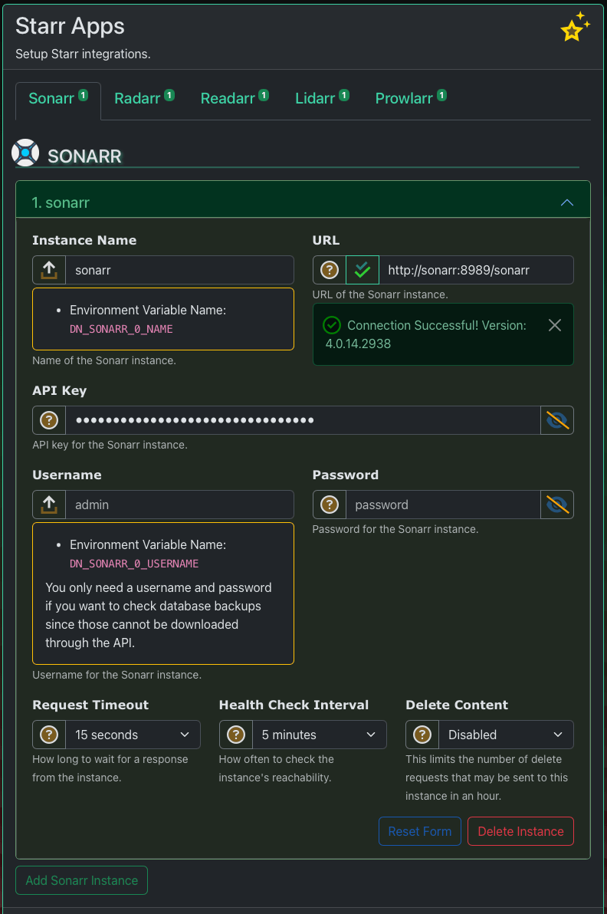

# Notifiarr Client After Install

Do these things:

1. [Log into the Web UI](#web-ui) to configure the client.
1. [Set a Hostname](#hostname).
1. [Setup Plex Webhook](#plex-webhook).
1. [Install Snapshot Dependencies](#snapshot-dependencies).
1. Do all the things under [Configure the client](#configure-the-client).

## Web UI

When you open the application on MacOS or Windows for the first time, you're
prompted for your API key. Enter it. Must provide the "All" API key from your
[Profile page on notifiarr.com](https://notifiarr.com/user.php?page=profile)

!!! info "API Key"
    The Notifiarr client uses the API key for bi-directional authorization between notifiarr.com and the Client. Keep it safe, and never share it.

If you're on Linux or FreeBSD and installed with root, you should set the API
key in the config file @ `/etc/notifiarr/notifiarr.conf` or
`/usr/local/etc/notifiarr/notifiarr.conf`. If you installed on a seed box, set
the API key in the config file in your home folder.

Login to the client's WebUI for the first time with your **Notifiarr.com email address and password**.
You can set a dedicated local password after logging in by clicking your
*username in the menu => Trust Profile*.

The login URL will usually look like one of these. The default listen port is `5454`.

- `http://localhost:5454`
- `http://notifiarr`
- `http://192.168.1.10:5454`
- `http://notifiarr.yourdomain.com` (if you setup a [proxy](reverseProxy.md))

## Hostname

It is important that a static hostname is set so the site can keep track of multiple clients' settings.
Some examples of how to do that:

- Docker Run users add `-h notifiarr` to your `docker run` command.
- Docker Compose users add `hostname: notifiarr` to your docker-compose.yaml file.
- Unraid users add `-h notifiarr` to `Extra Parameters`.
- Kubernetes hostnames are automatically determined based on the pod name.

!!!note
    Failure to set a hostname will result in duplicate clients that need to be
    [fixed once a hostname is set](../../pages/website/clientConfig.md#resolving-duplicate-clients).
    **Restart the client if you set or change the hostname.**

## WSL2 users

Add this volume to your Notifiarr container. This is used for a unique UUID for each client instance.

```yaml
volumes:
  /etc/machine-id:/etc/machine-id
```

## Docker Users

When a new docker image is deployed with an empty `/config` folder mounted, the app will:

- Write a brand new config to `/config/notifiarr.conf` file.
- On first run, the WebUI will prompt you for your API key.
- After entering your API key, login with your **Notifiarr.com email address and password**.
- You can set a local password after logging in via *Config → Password*.

Environment Variables - and the Unraid Template - override settings in the Config file.

!!! danger "Unraid Users"
    The Official Unraid Template for Notifiarr Client contains the API Key and Plex Token as pre-defined inputs.
    Normally, you can just go ahead and set those there. Alternatively, you can delete them from the template, and
    configure these values using the client's Web UI. For consistency, we recommend setting the API key and Plex token
    in the Unraid template.

## Plex Webhook

If you're using Plex, you can configure it to send Notifications. Unlike other integrations, Plex
sends all its webhooks through the client. We do this because Plex can get overzealous with how
much data it sends. The client can buffer these webhooks and filter duplicate notifications.
It also checks the Plex API for sessions after it gets a webhook so it can provide richer notifications.

!!!info "Plex Token"
    You must configure the Plex URL and
    [Plex Token](https://support.plex.tv/articles/204059436-finding-an-authentication-token-x-plex-token/)
    in the client Web UI *Media Apps* page for this to work.

- In Plex Media Server, add this URL to webhooks:
  - `http://localhost:5454/plex?token=plex-token-here`
- Replace `localhost` with the IP or host of the notifiarr client application.
- Replace `plex-token-here` with your plex token.
- **The Notifiarr application uses the Plex token to authorize incoming webhooks.**

## Snapshot Dependencies

This application can take a snapshot of your system at an interval and send
you a notification. Snapshot means system health like cpu, memory, disk, raid, users, etc.
Other data available in the snapshot: mysql health, `iotop`, `iostat` and `top` data.
Some of this may only be available on Linux, but other platforms have similar abilities.

If you monitor drive health you must have smartmontools (`smartctl`) installed.
If you use smartctl on Linux, you must enable sudo. Add the sudoers entry below to
`/etc/sudoers` and fix the path to `smartctl` if yours differs. If you monitor
raid and use MegaCli (LSI card), add the appropriate sudoers entry for that too.

To monitor application disk I/O you may install `iotop` and add the sudoers entry
for it, shown below. This feature is enabled on the website.

### Snapshot Sudoers

The following sudoers entries are used by various snapshot features. Add them if you use the respective feature. **Restart the client after modifying sudoers entries.**
You can usually just put the following content into `/etc/sudoers` or `/etc/sudoers.d/00-notifiarr`.
Make sure the 00-notifiarr file has the proper permissions needed `chmod 400 /etc/sudoers.d/00-notifiarr`.

```yml
# Allows drive health monitoring on macOS, Linux/Docker and FreeBSD.
notifiarr ALL=(root) NOPASSWD:/usr/sbin/smartctl *

# Allows disk utilization monitoring on Linux (non-Docker).
notifiarr ALL=(root) NOPASSWD:/usr/sbin/iotop *

# Allows monitoring megaraid volumes on macOS, Linux/Docker and FreeBSD.
# Rarely needed, and you'll know if you need this.
notifiarr ALL=(root) NOPASSWD:/usr/sbin/MegaCli64 -LDInfo -Lall -aALL
```

### Snapshot Packages

Install optional package(s) for snapshot data collection.

#### Windows

 `smartmontools` - get it here <https://sourceforge.net/projects/smartmontools/>

#### Linux

- Debian/Ubuntu: `apt install smartmontools`
- RedHat/CentOS: `yum install smartmontools`
- **Docker**:    It's already in the container. Lucky you! Just run the container in `--privileged` mode.
- **Synology**: `opkg install smartmontools`, but first get Entware:
  - Entware (synology):  <https://github.com/Entware/Entware-ng/wiki/Install-on-Synology-NAS>
  - Entware Package List:  <https://github.com/Entware/Entware-ng/wiki/Install-on-Synology-NAS>

## Configure The Client

{ width="250" align="right" }

- **This is your after install check list.**

It does not cover everything, but it's the things you should get done first.
You should definitely check out the stuff above though, a lot of it is important prerequisites.

### Set a password

Set a password, or configure your auth proxy header on the *Trust Profile* page.
Find this page by clicking your username in the Web UI menu. There's a screenshot
of it to the left; click that to see a larger version.

### Setup Log Files

Head to the *Settings => Configuration* page and scroll down to *Logging*.
If you don't see an *Application Log File* (and only a placeholder), then add one,
and click Save Configuration.

{ width="400" }

Click the Folder icon to open a server-side file browser.
You may optionally add Services, HTTP and Debug log files. These are not strictly necessary.

{ width="250" align="right" }

### Configure Apps

!!!info "Test Button"
    Click the Test button while adding instances. Make sure it works. The test button is
    the green double-check mark button next to the URL.

1. On the Starr Apps pages, configure your apps.
    1. We recommend adding them all. If you have all the starr apps, add them all.
    1. All you need is a URL and an API key.
    1. If you turn on database backup checks (on the website), a username and password is also required.
1. Add all your download apps too. And Plex, and add Tautulli if you use it.
    Find these on their respective pages: *Download Apps* and *Media Apps*.

### Health Checks

Set the health check intervals on all your apps if you want notifications when an app goes down.
See the [Health Checks](./healthChecks.md) page for more information about that.

## Log Files

{ width="250" align="right" }

**Log file contents can be viewed in the UI under *Insights => Log Files*.**

These are the default location for application output (logs).
Make sure you [setup a log file](#setup-log-files) if you can't find your logs.

- Linux: `/var/log/notifiarr/{app,http,services}.log`
  - Log paths for linux apt/deb installations are hardcoded
- FreeBSD: `/var/log/syslog` (w/ default syslog)
- macOS: `~/.notifiarr/Notifiarr.log`
- Windows: `<home folder>/.notifiarr/Notifiarr.log`
- Docker: `docker logs Notifiarr` (recommend [setting a log file](#setup-log-files))
