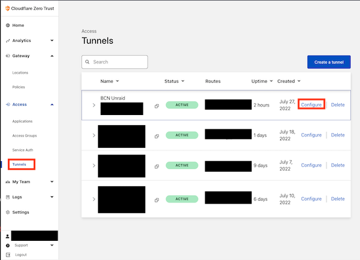
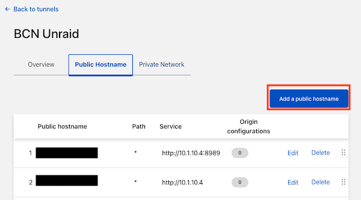
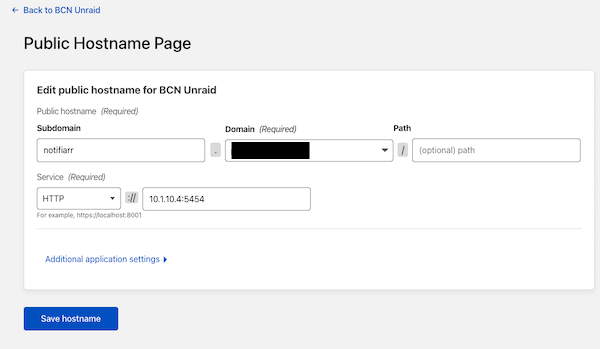

# Notifiarr Client Cloudflare Proxy

!!! danger
    None of this is required or necessary. **We recommend NOT exposing your
    Notifiarr client to the Internet at all. In other words, don't do any of this.**
    But you can if you want to access your local Notifiarr Client from the Internet.

Some users use Cloudflare's "Cloudflare Tunnel" feature or additional Cloudflare security
features to provide protected external access to their Notifiarr Client and other services.
Specific configuration required for Cloudflare's various options are detailed below.

## Cloudflare Tunnel

!!! info
    This assumes that you already have a Cloudflare Tunnel set up on your system.
    If you want to get started with Cloudflare Tunnels follow this YouTube guide first:
    [Cloudflare Tunnel: Creating Tunnels via GUI - Bypass CG-NAT by IBRACORP](https://www.youtube.com/watch?v=RUJy9fjoiy4)

1. Login to your Cloudflare teams account at [dash.teams.Cloudflare.com](https://dash.teams.Cloudflare.com/)
1. Click **Tunnels** and then **configure** next to the Cloudflare Tunnel you would like to use.
    
1. In your Tunnel section click on **Public Hostname** and add a new hostname by clicking on **Add a public hostname**.
    
1. Fill in the public hostname information on the next screen.
    
    1. `Subdomain`: Notifiarr (or whatever else you want it to be)
    1. `Domain`: choose one of your domains
    1. `Service`: HTTP + Your Local IP Address for Notifiarr

Save your host name settings, that's it! Your client is now exposed to the Internet!
