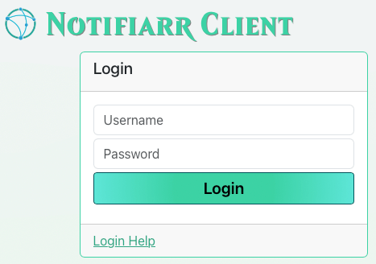
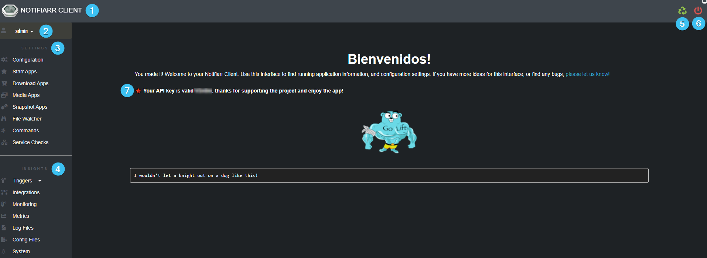
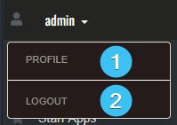
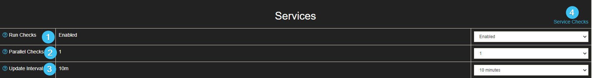
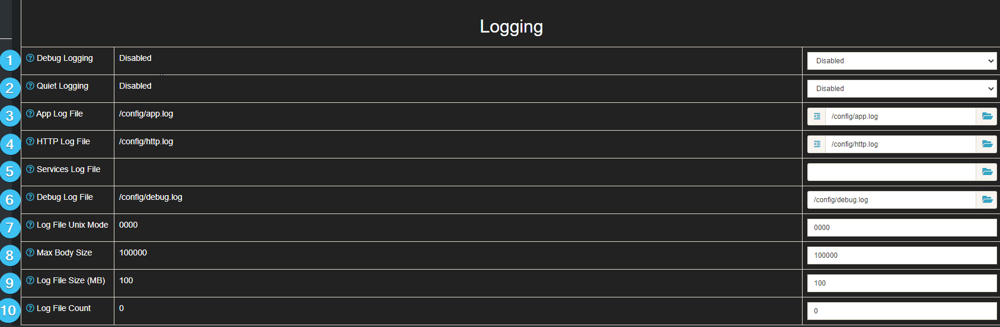

# Notifiarr Client UI

The Client UI is the preferred and recommended method of modifying the Notifiarr configuration file. Its GUI provides an easy and intuitive interface for all users to configure Applications for use with Notifiarr.

---

## Enabling the Client UI

Once the Notifiarr client is installed, follow the instructions to set the UI Username/Password as described under [Client -> Setup -> Web UI](../../pages/client/setup.md#web-ui)

Once the above is done, point your browser to the client and you will be taken to the login screen. Login with your specified Username (default: admin) and configured Password.

For initial runs:

- If the API Key is configured and valid your password is the APIKey
- If the API Key is invalid and if there is no existing config the password will be printed in the logs on first run.



## Forgotten Passwords

## Locate the Password in config file prior to UI Access

Execute the below command to print the unecrypted first-start password. **This only works for brand new installations.**

```bash
# Fix the path yourself:
grep ui_password  /path/to/notifiarr/notifiarr.conf

# Unraid usually:
grep ui_password  /mnt/user/appdata/Notifiarr/notifiarr.conf
```

## Liunx / FreeBSD

1. Run this command which resets the password then restarts the applicatoin

```bash
# Reset password.
notifiarr --reset
# Restart client (linux).
systemctl restart notifiarr
```

## Windows

1. Run this command, and then restart the application

```bash
notifiarr.exe --reset
```

## Docker

\*Also applies to Unraid\*

1. Run these two commands in your host system's terminal (console) while the Notifiarr container is running.
   *If your container is named `notifiarr` then replace `Notifiarr` with the lowercase version.*

```bash
docker exec Notifiarr /notifiarr --reset
docker kill --signal=HUP Notifiarr
```

```bash
# Example output with new password:
[INFO] 2023/09/08 09:32:11 New 'admin' user password: four38=Draw
[INFO] 2023/09/08 09:32:11 Writing Config File: /config/notifiarr.conf
```

1. If you still can't login, restart the container.

---

## Client UI Homepage

Once logged in you will be taken to the Homepage. From here you are free to navigate the Client and have the power to Modify, Update, Trigger Applications/Integrations and much, much more.



1. `Notifiarr Client` - Clicking this at any stage will take you back to the Homescreen.
1. `Admin` - Provides the user the option to view their profile and to log out of the Client UI.
1. `Settings` - This area allows the user to customize all the available Applications and integrations.
1. `Insights` - This area provides the user analytics and information on how certain integrations are performing as well as the ability to view logs from the Notifiarr Client.
1. `Restart` - Reloads the application configuration and restarts the Client UI.
1. `Shutdown` - This will shut down your local client and will require you to manually start it back up again.
1. A line of text with your username and advising that your API key is valid.

---

## Admin



1. `Profile` - In here you can change your username and password.


1. `Logout` - Log out of your Client Homepage.

---

## Settings

The following sections will be discussed in more detail.


## Configuration

Under the configuration menue you can further setup your Notifiarr Client within the following sections.

!!! warning
    Note that some values may be locked as they are trumped by Enviormental Variables.  Unraid requires the use of the API Key and Plex Settings as enviormental variables.

Variables being overwritten with an enviormental variable will look like this.


---

### General

The General section is more catered to the ingress and egress options/functionality of the Notifiarr client.

!!! info
    In most cases the default value will be fine and should only be modified if required.


1. `Setting Column` - Contains the settings you are modifying.
1. `Current Value Column` - Shows the current value of the setting
1. `New Value Column` - Shows the new value for the setting that is being changed.
1. `API Key` - API key from your Notifiarr.com account, required for security validation.

!!! warning
    This API must be an All key!

1. `Extra Keys` - This application uses the Notifiarr.com API key (set above) for incoming authentication.
It's not safe to give that key to any other website, person, or third party service.
This is because that key is also used for authentication to the Notifiarr.com API.
If you want third parties to authenticate to this application's API, you should create custom keys for each integration.
As of March 8, 2022, there are no existing integrations, so this is for future use. You can use this section to add
extra API keys. Whatever you want. Separate them with newlines or spaces.
1. `Bind Address` - This is the IP and port the app will listen on. 0.0.0.0 means all IPs, and you should use that in almost all cases! Change the port if the default 5454 does not work for you.
1. `URL Base` - This application serves HTTP on / by default. You can change that by typing in something else here.
1. `Upstreams` - If Notifiarr client is behind a reverse proxy (swag, nginx, etc), then you should add that proxy IP here. You can also specify full networks. This controls which IP is written to the web server log file (requestor or x-forwarded-for header). It also allows the x-webauth-user header for proxy authentication. Separate with spaces or new lines.
1. `Host ID` - The Host ID parameter is used to uniquely identify this client installation. Changing this value is discouraged; it should be found automatically. Do not copy this value to another Notifiarr client insallation.
1. `Parallel Threads` - Disabling this setting will make the application use fewer go routines (threads) when gathering data from configured applications. Spreads out CPU usage and lowers memory footprint.
1. `Retries` - Sometimes connections to Notifiarr.com fail. This controls how many times each request will be attempted in case of failures.
1. `Timeout` - This is the timeout for API requests to Notifiarr.com.

---

### SSL

The SSL section handles the SSL Certificates and where they are kept so that the Client may use it.


1. `Cert Key File Path` - This is the path to the SSL certificate key file. This is a secret! See Certificate File help for more info.
1. `Cert File Path` - This application can serve HTTPS. Enable that by specifying a certificate file path and key file path. The certificate file should have the full CA chain included.

---

### Services

The Services section is used specifically to adjust the Service checking of all your Apps.

!!! info
    In most cases the default value will be fine and should only be modified if required.



1. `Run Checks` - Disable or enable monitoring all network and services checks right here.
1. `Parallel Checks` - Normally running service checks 1 at a time is fine, but if you have more than 30 or 40, you may want to increase this. This controls how many checks may run at once.
1. `Update Interval` - How often to send service check results to Notifiarr.com.
1. `Service Checks` - This is a shortcut to the Service Checks settings page.

---

### Logging

The Logging section, as the name suggests, is centred around the Notifiarr Client logs and has various settings the user can change.

!!! info
    In most cases the default value will be fine and should only be modified if required.



1. `Debug Logging` - Enabling debug logging causes a lot more data to write to the log. Includes payloads to and from Notifiarr.com and starr apps. Use Max Body settings to control payloads sizes.
1. `Quiet Logging` - Enabling Quiet makes the app not print anything to stdout. This is useful when a log file is enabled and you don't want logs spewing into a start-up daemon too.
1. `APP Log File` - Setting a log file path here will make the application write logs to this path. Highly recommended!
1. `HTTP Log File` - Setting a log file path here will make the application write the HTTP logs to a dedicated file. The file format is in apachelog. Highly recommended.
1. `Services Log File` - Setting a log file path here will make the application write service check results to a dedicated file. Recommended if you have a lot of services.
1. `Debug Log File` - Setting a log file path here will make the application write debug messages to a dedicated log file. Otherwise debug messages write to the main application log.
1. `Log File Unix Mode` - This is the unix file mode used when writing new log files. Recommended values in order of openness: 0600, 0640, 0644
1. `Max Body Size` - When debug is enabled, this setting limits the amount of payload data written to the log, to or from Notifiarr.com.
1. `Log File Size (MB)` - When rotation is enabled (setting Max Log File Count higher than 1), this setting controls how large a file must be to trigger rotation.
1. `Log File Count` - When this setting is 0 or 1, log file rotation is disabled. Setting this to a higher value will rotate all log files, and keep this many of each on disk. Controls all log files.

---

## Starr Apps

!!! info "Starr Apps"
    \* Completely disable an instance by setting the Timeout to Disabled.
    \* Disable service checks by settings Interval to Disabled.
    \* Use local URLs! Timeouts happen all the time when using a proxied URL
    \* TRaSH Sync currently requires the Starr Apps to be synced to be named.

TBA - Refer to the (?) Icons for more information

## Download Apps

TBA - Refer to the (?) Icons for more information

## Media Apps

TBA - Refer to the (?) Icons for more information

## Snapshot Apps

TBA - Refer to the (?) Icons for more information

## File Watcher

TBA - Refer to the (?) Icons for more information

## Commands

TBA - Refer to the (?) Icons for more information

## Service Checks

TBA - Refer to the (?) Icons for more information

---

## Insights

### Triggers

TBA - Refer to the (?) Icons for more information

### Integrations

TBA - Refer to the (?) Icons for more information

### Monitoring

TBA - Refer to the (?) Icons for more information

### Metrics

TBA - Refer to the (?) Icons for more information

### Log Files

TBA - Refer to the (?) Icons for more information

### Config Files

TBA - Refer to the (?) Icons for more information

### System

TBA - Refer to the (?) Icons for more information
