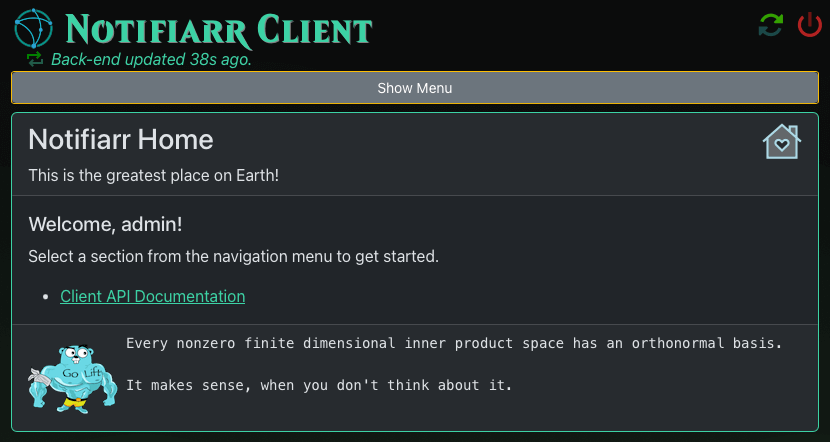

# Notifiarr Client Web UI

The client's Web UI is the preferred and recommended method of modifying
the Notifiarr configuration. The Web UI provides an easy and intuitive
interface to configure Integrations for use with Notifiarr.

## Forgotten Passwords

Head back to [After Install](afterInstall.md#web-ui) or
[Troubleshooting](troubleshooting.md#forgotten-passwords) for help getting logged in.

## Landing Page

Once logged in you will be taken to the Landing page.
From here you are free to navigate the Client and have the power to
update settings, configure and trigger integrations and much, much more.

The Web UI is full of documentation. **It's even available in multiple languages.**
If you have suggestions where the UI can be improved, or documentation added,
please reach out on [Discord](https://notifiarr.com/discord), or
[open a new Issue](https://github.com/Notifiarr/notifiarr/issues/new) on GitHub.
We encourage and appreciate your feedback!

!!!warning "Client Configuration"
    Find the primary configuration documentation in the Web UI.

---

Find more information in the legacy [Configuration](configuration.md) page.
It's a legacy page, but the information in it is still accurate.
