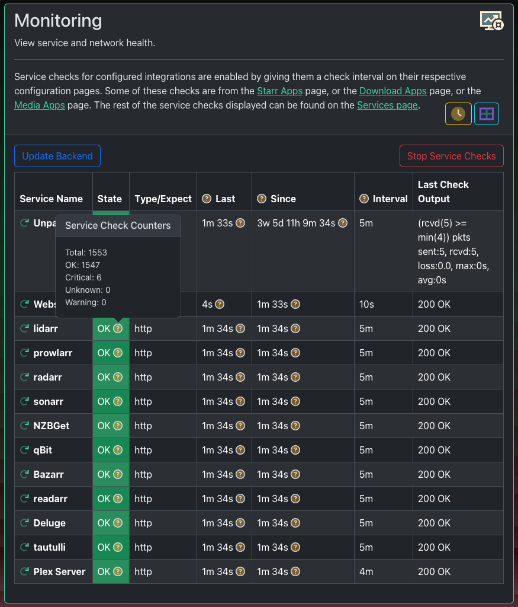

# Notifiarr Client Health Checks

This is one of the most powerful features we provide. And it's free.
You can configure an unlimited number of service checks in the Notifiarr
Client. These checks can check URLs for specific response codes, look for
running processes, or check TCP ports.

!!!warning "Enable Network Integration"
    - This client feature sends reports to the [website] using the *Network Integration*.
    - Make sure you enable that Integration on the website and choose a chat channel for notifications.

This page explains the logic the [service check module] uses.

{ width="250" align="right" }

## Automatic Instance Checks

The application will automatically add service checks for any instances you configure.
An instance is just an application like Radarr or Transmission. When you add the instance,
all you need to do is choose a *Check Interval* duration. That determines how often the
client checks the instance's health.

!!!danger "Assumptions"
    Some of the automatic service checks may set the HTTP expect code to something other
    than 200 / OK. This is normal. There are few configurations for the automatic service
    checks, most settings are hard coded assumptions. The [test buttons] in the Web UI
    use different logic than the [automatic service checks].

**The automatic service checks do not work in every environment.**
You should disable them, and create custom checks if they are not working for you.

{ width="250" align="right" }

## Custom Health Checks

Health checks currently supported are `HTTP`, `TCP port`, `ICMP`, and `UDP Ping`.
Future versions may include the ability for [subscribers] to run commands and scripts.

Configure custom checks in the Web UI on the *Settings => Services* page.
The Web UI does a good job of documenting the service check configuration, so
this section is light on words. Go check out the Web UI for information about
how to configure a service check. The screenshot to the right does not do it justice.

## Monitoring

- Find current statuses on the *Insights => Monitoring* page in the client Web UI.
- Configure a custom *Service Status Page* on the [website] in the **Network Integration**.

{ width="250" align="right" }

!!!info "Website Configuration"
    Configure the notifications chat channel, which role gets pinged, and a few
    other notification settings in the **Network Integration** on the [website].

When a service changes state the new state is immediately reported to the website.
By default the website will turn this state change into an immediate notification.
The notification goes to the *Network Integration* channel that has been selected.

[website]: https://nightly.notifiarr.app/user.php?page=integrations#
[automatic service checks]: https://github.com/Notifiarr/notifiarr/blob/04ae29c5d0e7c01bd0dd9cfa53302ca7bf4f8d5b/pkg/services/apps.go
[test buttons]: https://github.com/Notifiarr/notifiarr/blob/04ae29c5d0e7c01bd0dd9cfa53302ca7bf4f8d5b/pkg/checkapp/downloaders.go
[service check module]: https://github.com/Notifiarr/notifiarr/tree/main/pkg/services
[subscribers]: ../faq/faq.md#q-what-are-the-user-level-differences
