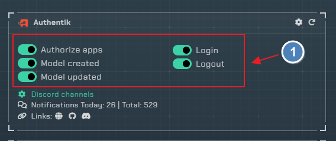
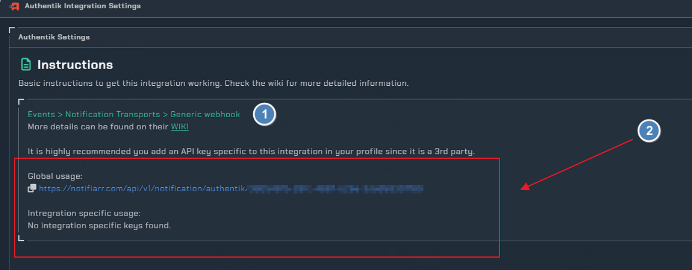
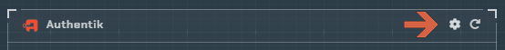
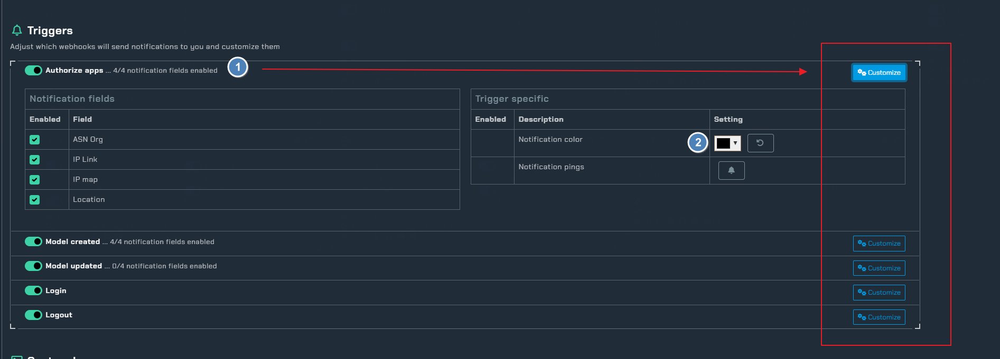
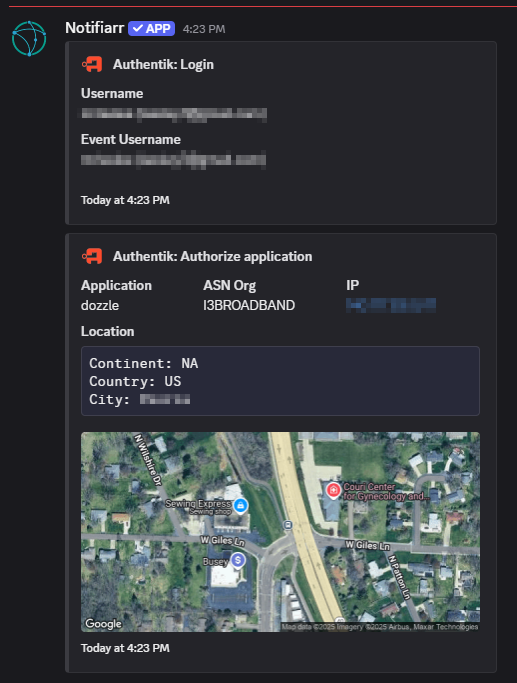

!!! info 
     This integration is for setting up discord notifications for Authentik 
     
---

## Trigger options

- `Authorize apps` - when applications are authorized with the correct login credentials
- `Model created` - when new models are created in the admin interface
- `Model updated` - when models are updated/changed in the admin interface
- `Login` - when successful logins occur
- `Logout` - when logouts occur

### Instructions

!!! info "Authentik Notifications"
     Detailed wiki for [Authentik Notifications](https://docs.goauthentik.io/docs/sys-mgmt/events/notifications)
    

1. Instructions on how too set webhook notifications in Authentik
2. the webhook URL you will use in Authentik 

## Configuration

Click the cog icon too open the configuration settings

1. enabling each `trigger field`, and using the `customize toggle` too drop down the `notification fields` for each trigger
2. choosing the color of the notification 

### Example Notifications
Here is an example with all `notifcation fields` enabled for the `Login` and `Authorize apps` triggers 

