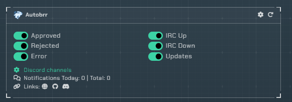
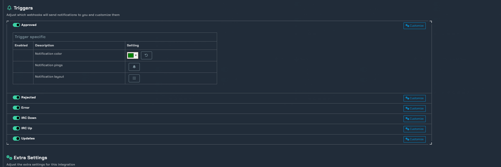
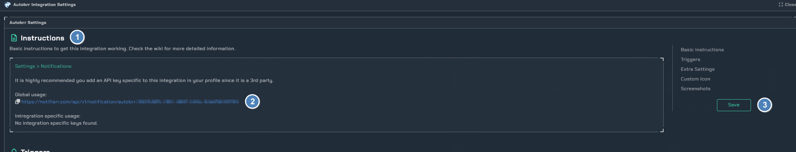
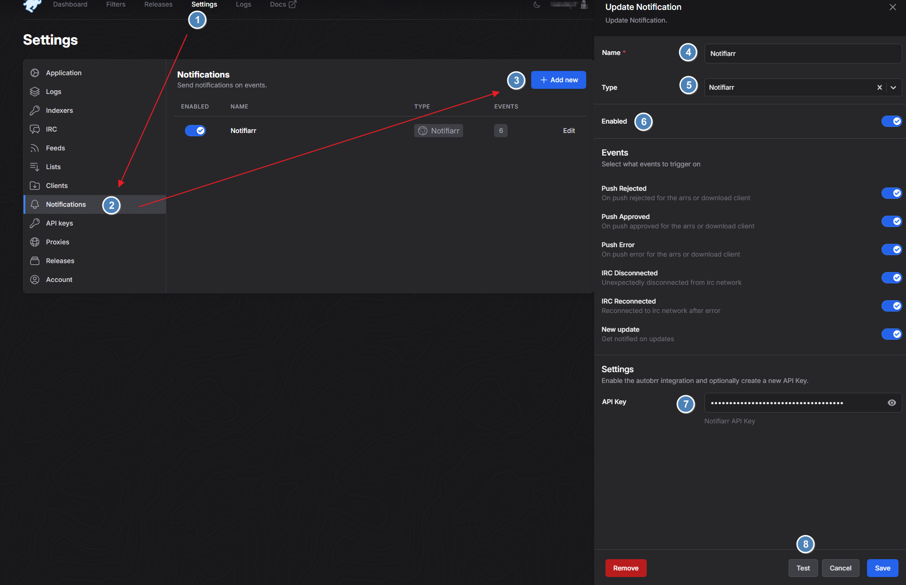
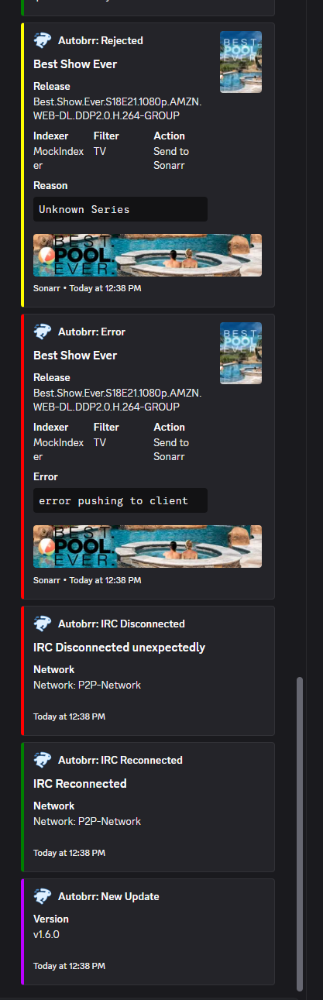

# Autobrr

!!! info
    This integration is to enable discord notifications for autobrr.

## Trigger Options

`Approved` - Be notified of approved media.

`Rejected` - Be notified of rejected media.

`Error` - Be notified of any errors that may occur.

`IRC Down` - Be notified of any Down IRC.

`IRC Up` - Be notified when the IRC is back Up.

`Updates` - Be notified of any updates available.

### Configuration

Here you can customize the layout and color of your notifcation for each avaiable `trigger`

### Instructions

1. Basic instructions to setup autobrr notifications.
2. The API key used within the autobrr settings → Notifications.
3. Always save.

!!! info
    Here is how to setup your notifcations in autobrr.

### Test Notification Examples

