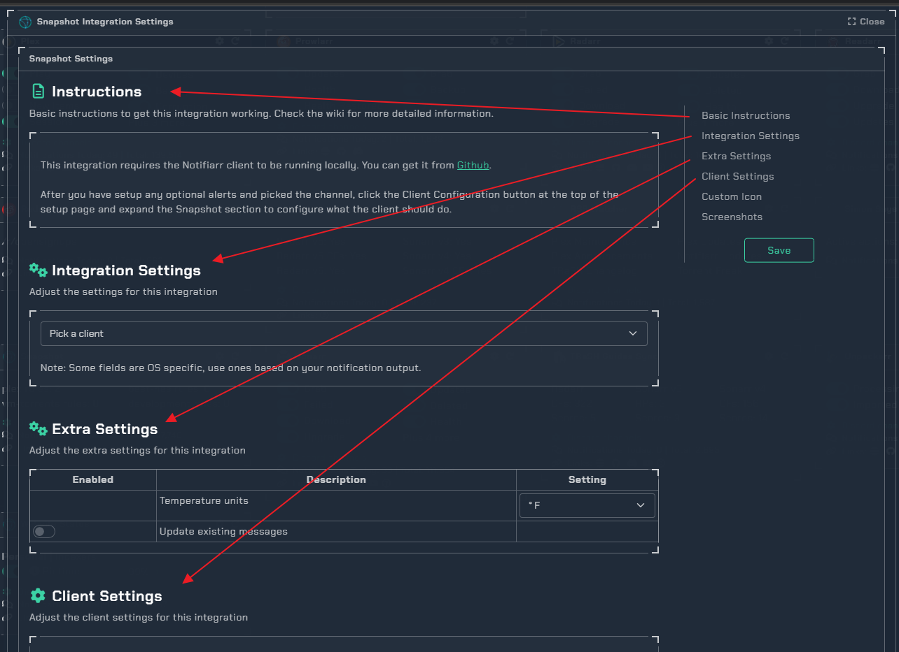
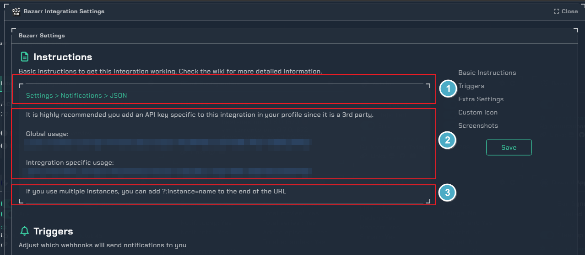
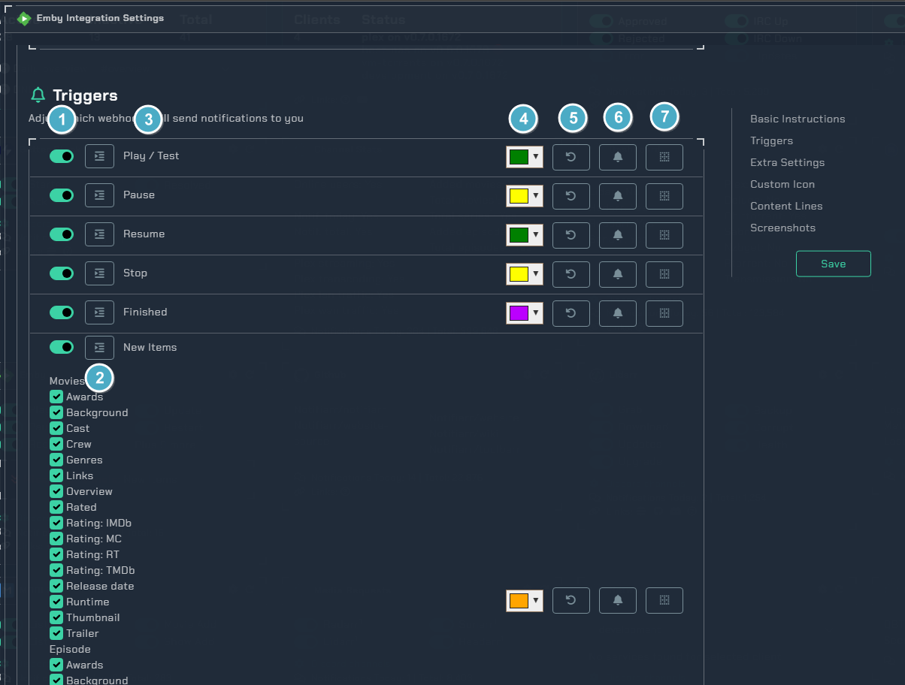

# How To Setup Integrations
!!! info

     All the integrations follow the same layout and logic so this means once you understand how one of them works you will be able to figure out how to setup any of them.

Each integration is split up into sections and there is a sub menu on the right (unless using mobile) that will help you jump to specific sections.

- Basic Instructions: Tell you the basics of how to get the integration to work
- Triggers: Allow you to turn on/off different notification types the integration has
- Integration/Extra Settings: Other things the integration can offer outside of the Triggers
- Client Settings: Any settings, timers, etc that the local client needs to work with this integration
- Custom Icon: A way to change the icon used for the integration on the site and notifications
- Content Lines: A way to get a small preview on mobile devices, wearables, computer toast notifications, etc
- Screenshots: What the integration notifications can look like

## Instructions

1. This section is typically information on how to get things working in the 3rd party app
2. This section is the apikey/url used in the 3rd party app. Many apps offer an optional apikey just for that 3rd party app that you can add in your profile
3. This section is any extra notes about using the integration

## Triggers

1. Toggle the trigger on/off to receive notifications
   
2. The button with the 3 lines on it allows you to customize the fields in the notification
   
3. The name of the trigger, will usually relate to what the 3rd party app calls it
   
4. The color of the notification
   
5. Reset the color back to default
   
6. Trigger ping settings which will allow picking a role that gets pinged everytime a notification is received for the selected trigger. (Pro tip: Press `Ctrl` when clicking to unselect the last item)
   
7. The button with the grid box allows you to customize where each field in the notification goes with a drag/drop interface