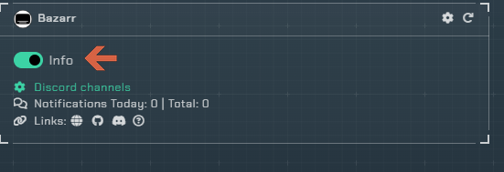
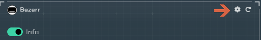
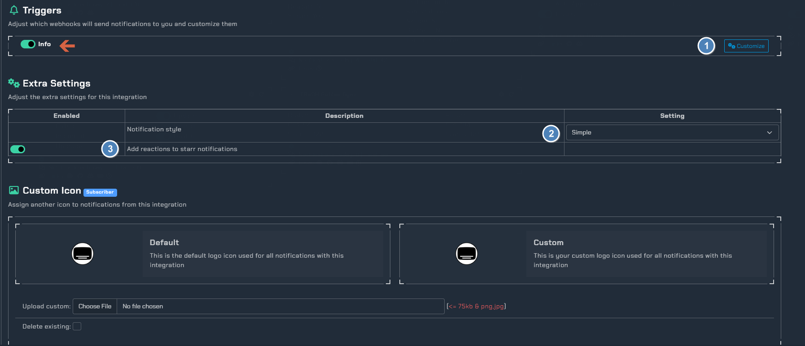
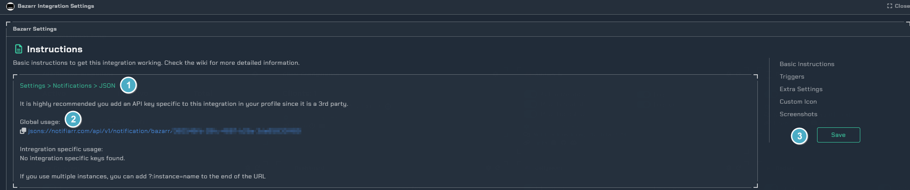

# Bazarr

!!! info
    This integration allows for notifications from Bazarr and will also add reactions to notifications if a subtitle was found for it and you are using reactions.

---

## Current Versions

{ .off-glb }
{ .off-glb }

---

## Trigger options

---

### Triggers

- `Info` - Currently all notifications use this type
- `Warning` - To date, Bazarr doesn't use this type
- `Success` - To date, Bazarr doesn't use this type
- `Failure` - To date, Bazarr doesn't use this type

---

### Channel

- Bazarr shares the *arr channel unless Granular Setup is used, clicking the link on the site will move to the channel setup location.

---

## Configuration

Click the **cog icon** to open the configuration options for Bazarr.

1. Open integration specific instructions
1. Choose the notification format
1. Enable reactions for `*arr` notifications when a subtitle is found if the associated `*arr` notification can be found

Reaction example:

---

## Instructions

1. How to enable notifications from within Bazarr
1. The URL to use in Bazarr
1. Test the notification from Notifiarr to Discord

!!! note
     This will ensure your server, channel and permissions are set properly in Discord
