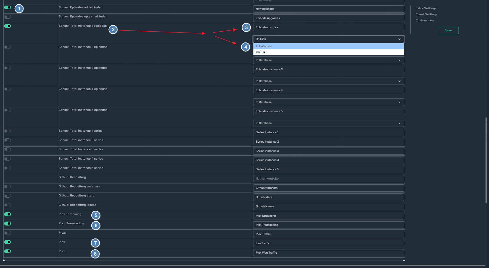
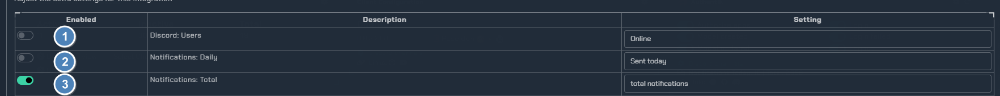
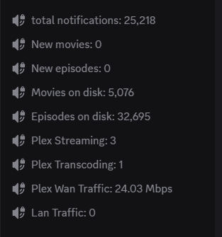

# Channel stats

!!! Prerequisites
    This integration requires both a [client](https://notifiarr.wiki/pages/client/install/) setup and the configuration of the [dashboard](https://notifiarr.wiki/pages/integrations/dashboard/) integration, as the channel stats will pull data from there.

!!! info
    `Channel stats` requires you to enable the `manage roles` and `connect` permissions within your discord settings for the notifiarr bot.

!!! warning
    Do not attempt to change any of the permissions or settings of the channels that are created by this integration. They are very specific, so they are read-only to users.

## Setup

Setup for `channel stats` is a little different than the rest; you don't need an API key, nor do you choose any channels. Since we have to give the bot the above permissions, it instead creates voice channels with the appropriate data that you enable.

While most of the information is pulled from the dashboard integration, things such as `New Movies` or `New Episodes` utilize the `Imported` trigger for the corresponding Starr integration. If you plan to use the github triggers, you will need to also setup the github integration.

!!! info
    You will also need the Plex client setup if you plan to use the available Plex triggers.

1. The trigger to enable each field that you may want.
2. `Sonarr Total` - This will display the total number in sonarr.
3. `Episodes on disk` - This is where you can choose how you want to name your `sonarr total` instance
4. choose to list either the total `On Disk` or `In Database`
5. `Plex Streaming` - Enabling this will list any plex streams that are happening.
6. `Plex Transcoding` - Enabling this will list any present transcodes on the server.
7. `Plex Lan Traffic` - Enabling this will display the current plex traffic on your LAN.
8. `Plex Wan Traffic` - Enable this will display the current plex traffic on your WAN.

**There are also some basic triggers such as:**

1. `discord: users` - Enabling this will list how many members are in the server.
2. `Notifications: daily` - Enabling this will list how many notifications you get day by day.
3. `Notifications: Total` - Enabling this will give you the total notifications that notifiarr has ever sent.

## Example

