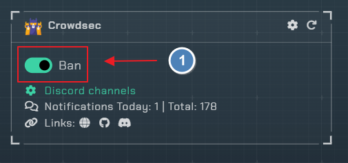
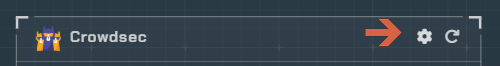
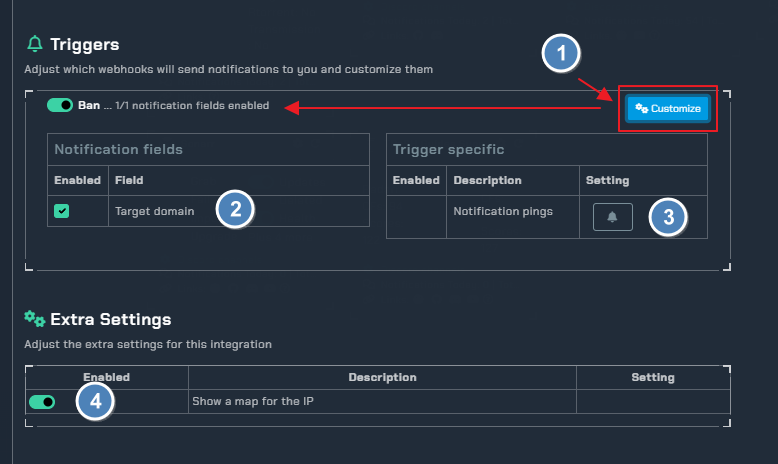
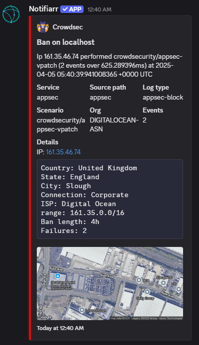
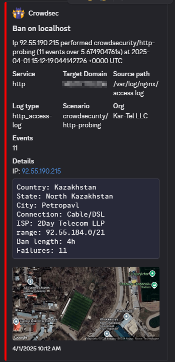

# Crowdsec

!!! note
    This integration allows webhook notifications for crowdsec

---

## Trigger options



- `Ban` - Be notified of any bans that occur

Click the cog icon too open the configuration settings



---

## Instructions

- you will need too edit your `/etc/crowdsec/notifications/http.yaml` file to look like this

```yaml
type: http          # Don't change
name: notifiarr  # Must match the registered plugin in the profile
log_level: info # One of "trace", "debug", "info", "warn", "error", "off"
format: |
  {{ .|toJson }}
url: https://notifiarr.com/api/v1/notification/crowdsec
method: POST # Any of the http verbs: "POST", "GET", "PUT"...
headers:
  Content-Type: application/json
  x-api-key: YOUR_APIKEY_HERE
```

make sure too replace `YOUR_API_KEY` with either your `global` API KEY or as its recommended you can create a API KEY for Crowdsec.

you will register notifiarr in the `profiles.yaml` in your crowdsec directory

```yaml
name: default_ip_remediation
filters:
 - Alert.Remediation == true && Alert.GetScope() == "Ip"
decisions:
 - type: ban
   duration: 4h
notifications:
  - notifiarr
on_success: break
```

!!! info "Crowdec Notifications"
    - Please refer too [Crowdsec-Notifications](https://docs.crowdsec.net/docs/notification_plugins/intro/) for issues with setup

---

## Configuration



1. Click the `Customize` toggle too show all available options for the `Ban` trigger
2. All available `notification fields`
3. Use this if you want to be pings
4. Enable GEO map locations in your notification

---

## Examples

appsec example             |  http example
:-------------------------:|:-------------------------:
  |  
