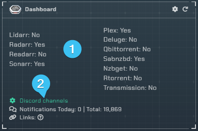
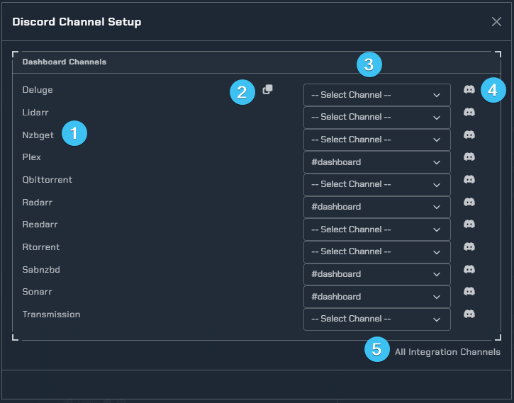
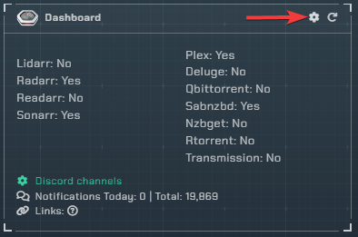
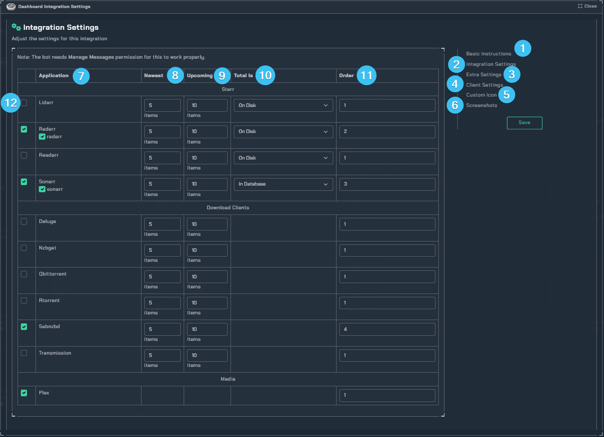
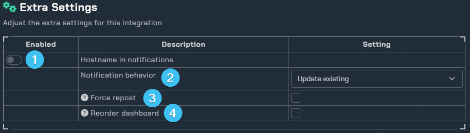
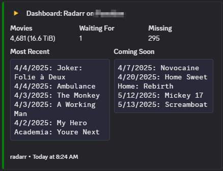
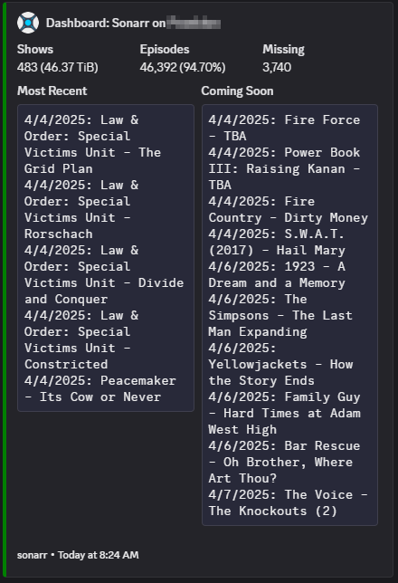

!!! info

     This integration allows for notifications to keep you updated with an overview of some commonly used apps.

---

The frequency of dashboard updates is controlled by the Notifiarr Client Configuration for the Dashboard for the specified client. All other Dashboard settings are noted below and within the Dashboard Integration.

## Trigger options

1. List of apps that are posting updates
2. Used to assign a discord channel to each of your apps to enable notifications

---

## Discord Channel Setup

1. List of currently supported Apps
1. Copies the first Discord channel to all channels below
1. Discord channel drop-down selection list
1. Discord bot permissions test. If the test passes the user will receive a notification from the bot in the specified channel. If no notification is received, please ensure you have assigned appropriate permissions to the Notifiarr bot.
1. Displays all available Discord channels in the users Notifiarr instance

---

## Configuration

Click the **cog icon** to open the configuration options for the Dashboard integration and the following window will open.

1. Initial instructions on how to setup the Dashboard by using the Notifiarr UI.
1. In this section you can define the active Apps and further configure them.
1. Contains additional Settings and customizations
1. Here you can set the update interval of the Dashboard
1. Allows you to change the default icon (Subscriber feature).
1. Some examples of the Dashboard output.
1. The apps you want to get info from.
1. How many of the newest items to see in the message (1-5).
1. How many of the upcoming items to see in the message (1-10).
1. How the Dashboard should display your completion ratio. Two options are available,
  - `In Database` - Compares your downloaded items against what the App considers a complete list.
  - `On Disk` - Compares your downloaded items to what you have on your disk.
11. The order in which to post the dashboard notifications.
1. Enables or disables the App from posting.

### Extra Settings

1. This will add the hostname to the notification title to know which machine it came from.
1. How would you like your notifications to be displayed in Discord. Two options are available,
  - `Update Existing` - A single notification will be received and continually refreshed.
  - `New Messages` - A new message will be sent with each update.
3. This will trigger a delete all and repost on the next update. **Note: this is a fleeting check box and the check will disappear after the save button is clicked.**
1. If the Dashboard order has changed, use this to clear all current posts and repost in the new order. **Note: this is a fleeting check box and the check will disappear after the save button is clicked.**

!!! warning

     When you change the active status or the order, the next update will trigger a delete all and repost everything automatically, so they are in the correct order based on what you have turned on.

## Examples

radarr example             |  sonarr example
:-------------------------:|:-------------------------:
  |  

