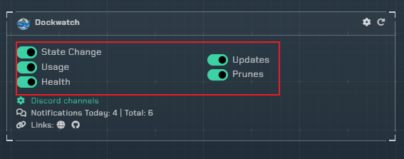
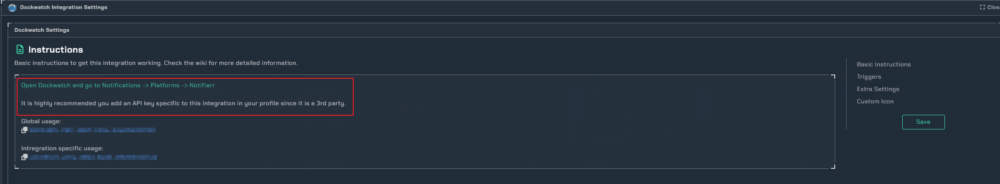
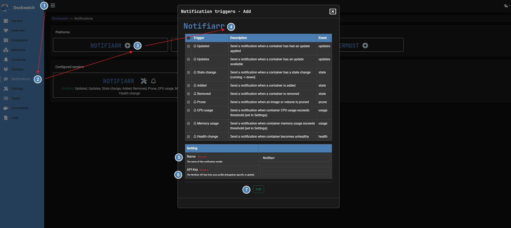
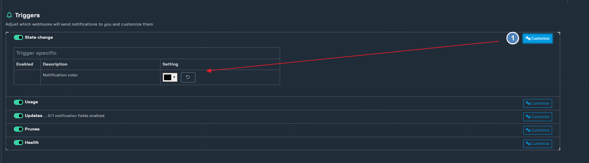
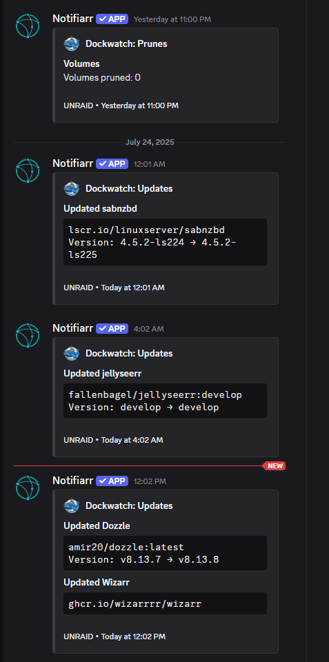

# DockWatch

!!! info
    This integration is for setting up discord notifications with dockwatch, Here you can find more information on [Dockwatch](https://dockwatch.wiki/)

## Trigger Options

1. `State Change` - Trigger a notification for container up/down state changes.

2. `Usage` - Trigger notifications for usages such as CPU, and memory **You must set usage thresholds in Dockwatch**

3. `Health` - Trigger a notification if a container becomes unhealthy.

4. `Updates` - Trigger a notification when a container has a available update.

5. `Prunes` - Trigger a notification when a container image, or volume has been pruned.

## Instructions

!!! note
    It is recomended to setup a API specifically for dockwatch.

Here is the setup on dockwatch's end.

1. Click the Three lines too extend the menu.

2. Go into the notification settings.

3. Choose Notifiarr under platforms.

4. Enable any triggers you may need.

5. set a name for the sender.

6. Paste your API key.

7. Save your settings.

### Configuration

1. `Customize` - Under the customize tab you can change the color of your notification for each available trigger.

### Notification Examples

