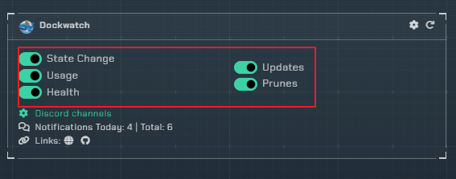
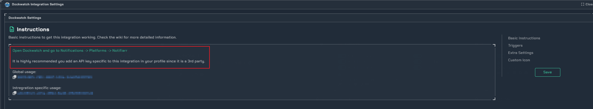
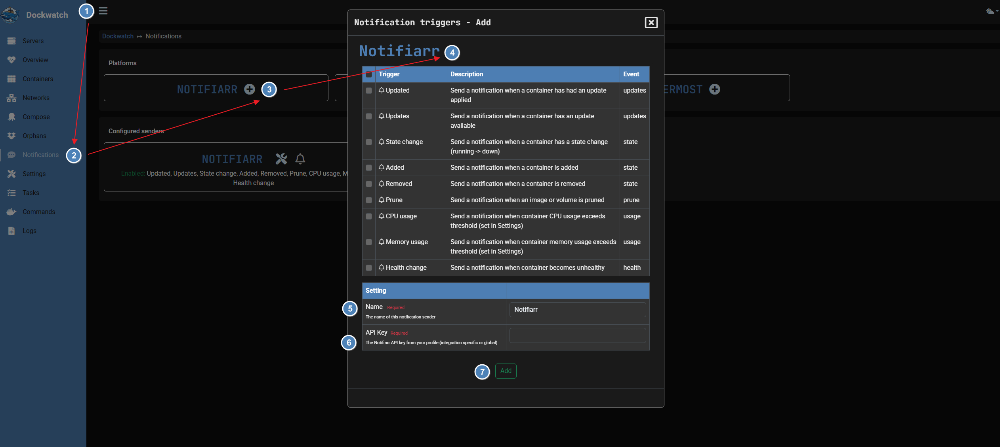
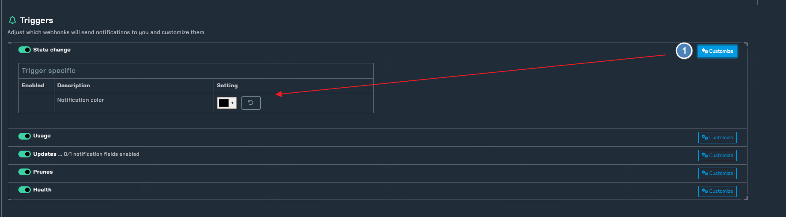
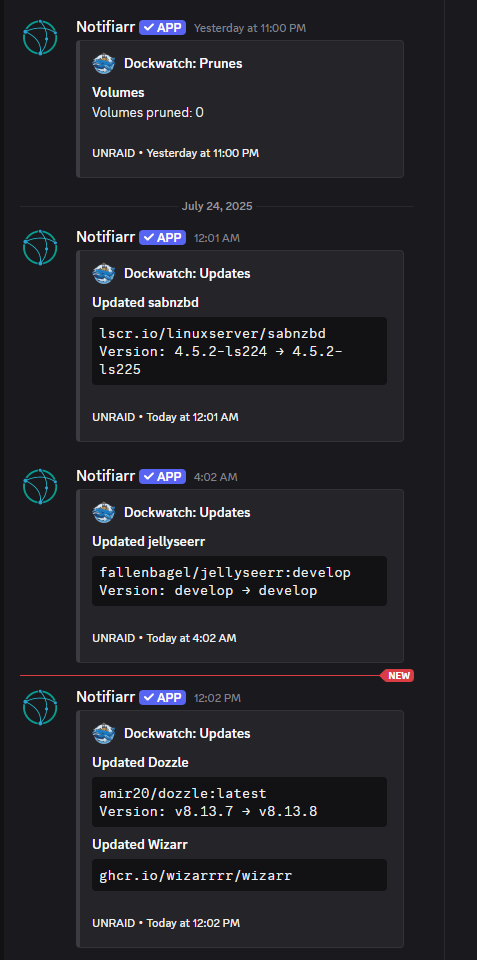

# DockWatch

!!! info
    This integration sets up Discord notifications for DockWatch. More information is available at the [DockWatch wiki](https://dockwatch.wiki/).

## Trigger Options

1. `State Change` - Trigger a notification for container up/down state changes.

2. `Usage` - Trigger notifications for usages such as CPU, and memory **You must set usage thresholds in Dockwatch**

3. `Health` - Trigger a notification if a container becomes unhealthy.

4. `Updates` - Trigger a notification when a container has an available update.
    - Notification field: `Digest hash` - Include the image digest hash in the notification.

5. `Prunes` - Trigger a notification when a container image, or volume has been pruned.

6. `Security` - Trigger a notification when DockWatch detects a security issue with a container.

7. `Intrusion` - Trigger a notification when DockWatch itself detects a security event on its own UI/API, such as an invalid login, login lockout, direct access attempt, invalid API key, unauthorized request, invalid CSRF token, or a WebSocket connection with missing params or an invalid token.
    - Notification field: `IP map` - When enabled, includes a generated map image showing the country/state/city/ISP for the offending IP (skipped for private/local IPs).
    - Depending on the event type, the notification may also include the request method, username, container, endpoint, API key, token, referrer, and user agent.

## Instructions

!!! note
    It is recommended to set up an API key specifically for DockWatch.

Here is the setup on dockwatch's end.

1. Click the Three lines to extend the menu.

2. Go into the notification settings.

3. Choose Notifiarr under platforms.

4. Enable any triggers you may need.

5. set a name for the sender.

6. Paste your API key.

7. Save your settings.

### Configuration

1. `Customize` - Under the customize tab you can change the color of your notification for each available trigger.
2. `Full image names` - Show the full image name instead of truncating with ellipsis.
3. `IP map` - Under the Intrusion trigger, include a map image with the offending IP's geolocation in the notification.

### Notification Examples

