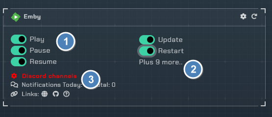
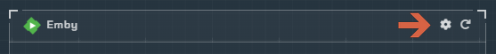
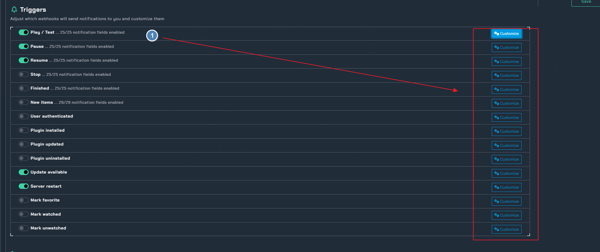
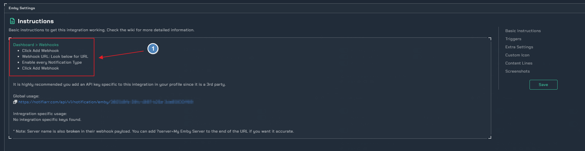

!!! info

     This integration allows for notifications from the Emby media app

## Trigger options

1. Triggers
    - `Play` - Receive a notification when media has started playing
    - `Stop` - Receive a notification when media has stopped playing
    - `Resume` - Receive a notification when media has resumed playing
    - `Update` - Receive a notification when Emby has a server update available
    - `Restart` - Receive a notification when Emby requires a restart
1. More Triggers
    - Open the configuration to enable/disable more triggers
1. Channel
    - Setup all the channels needed for each trigger

---

## Configuration

Click the **cog icon** to open the configuration options for Emby.

1. Enable triggers and pick colors for each trigger

### Instructions

1. This needs to be done in Emby to enable webhooks
