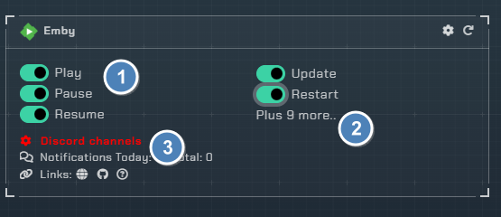
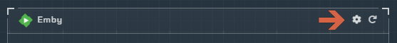
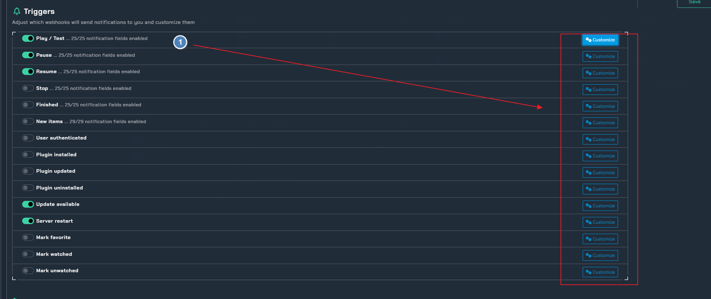
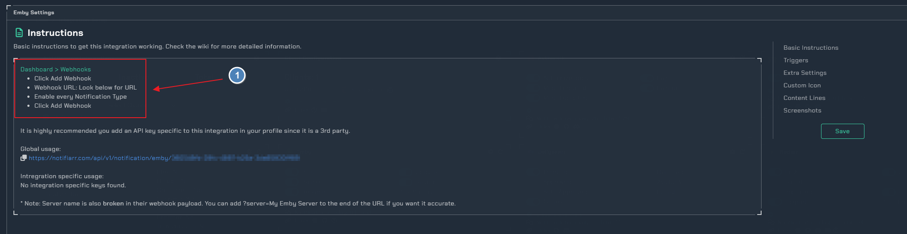

# Emby

!!! info
    This integration allows for notifications from the Emby media app

---

## Trigger options

### Triggers

- `Play / Test` - Receive a notification when media starts playing. Also used for testing the integration
- `Pause` - Receive a notification when media playback is paused
- `Resume` - Receive a notification when media playback is resumed
- `Stop` - Receive a notification when media playback is stopped
- `Finished` - Receive a notification when media has finished playing (scrobble)
- `New Items` - Receive a notification when a new item is added to the library
- `User Authentication` - Receive a notification on user login, failed login, or lockout
- `Plugin Installed` - Receive a notification when a plugin is installed
- `Plugin Updated` - Receive a notification when a plugin is updated
- `Plugin Uninstalled` - Receive a notification when a plugin is uninstalled
- `Update Available` - Receive a notification when an Emby server update is available
- `Server Restart` - Receive a notification when the Emby server restarts
- `Mark Favorite` - Receive a notification when a user marks an item as a favorite
- `Mark Watched` - Receive a notification when a user marks an item as watched
- `Mark Unwatched` - Receive a notification when a user marks an item as unwatched

### Channels

- Setup the channel(s) to use for sending Emby notifications

---

## Configuration

Click the **cog icon** to open the configuration options for Emby.

1. Enable triggers and pick colors for each trigger

### Integration Settings

- `Split by Rating` - Send notifications with selected content ratings to a separate channel
- `Unmonitor movies on finish` - Automatically unmonitor a movie after a user finishes watching (Patron feature, requires valid Radarr information in client)
- `Unmonitor episodes on finish` - Automatically unmonitor an episode after a user finishes watching (Patron feature, requires valid Sonarr information in client)

### Client Settings

The same **qBittorrent Speed Limit** block is on Plex, Jellyfin, and Emby Client Settings so saving any of those pages keeps the others.

1. `Enabled` - Turn on qBittorrent alternative (turtle) speed limits when remote playback is active. Set the alternative limits in qBittorrent first.
1. `Plex WAN` - Throttle while a Plex movie or episode is playing or paused on WAN (not LAN).
1. `Jellyfin` - Throttle on Jellyfin PlaybackStart and PlaybackStop for movies and episodes.
1. `Emby` - Throttle on Emby playback.start, playback.unpause, playback.stop, and playback.scrobble for movies and episodes. Pause does not turn turtle off.
1. `Cooldown` - How long to wait after remote playback ends before turning alternative speed limits back off.

Emby webhooks include `Session.RemoteEndPoint`. If that IP is private (LAN or Docker), throttle is skipped. If the field is missing, throttle still runs.

Plex uses WAN sessions on the client. Emby uses playback webhooks from the website. Plex and qBit must be on the same Notifiarr client.

---

### Instructions

1. This needs to be done in Emby to enable webhooks
