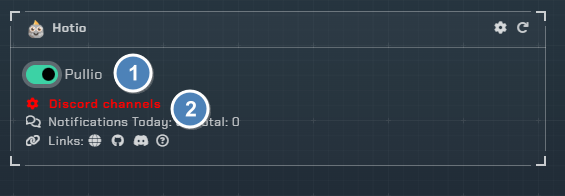
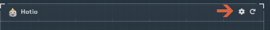
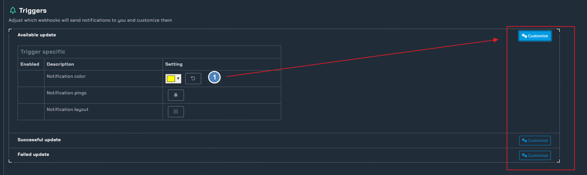
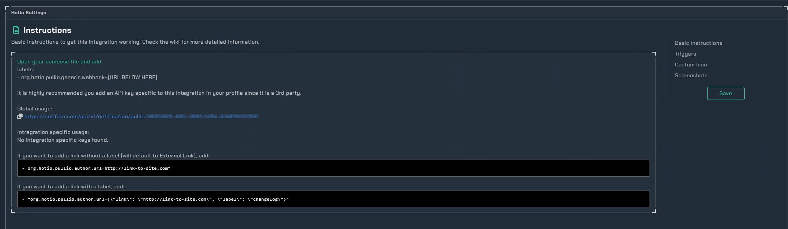

!!! info

     This integration allows for notifications from Hotio.
---

## Currently supported

- Pullio

## Trigger options

1. Triggers
    - `Pullio` - Enable notifications from Pullio
1. Channel
    - Pick the channel on your server to send Pullio notifications to.

---

## Configuration

Click the **cog icon** to open the configuration options for Hotio apps.

1. Pick the colors for the different Pullio update states

### Instructions

The compose entry to enable Notifiarr with Pullio

!!! note

     for images: If you do not specify an avatar image in the app compose one will be used from the site so you do not have to worry about image hosting sites.
