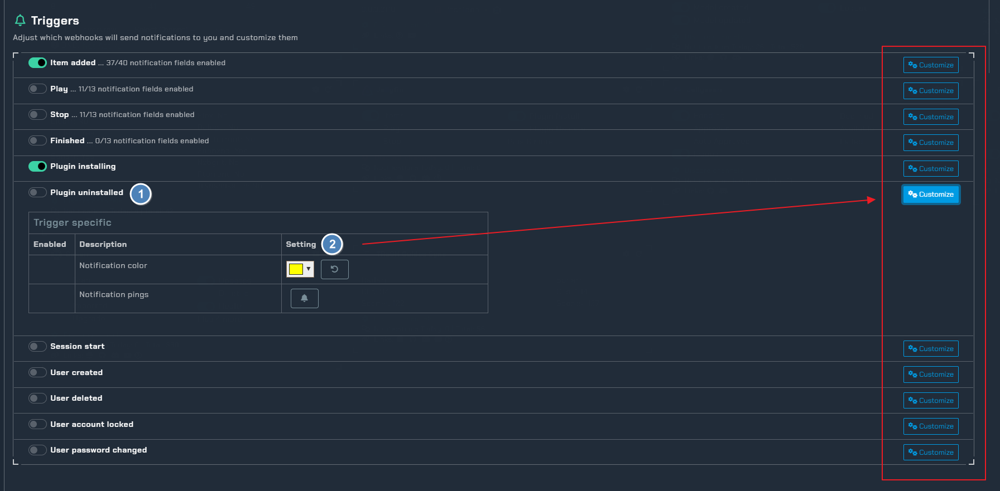

# Jellyfin

!!! info

     This integration allows for notifications from the Jellyfin media app

## Trigger options


1. Triggers
    - `Items` - Receive a notification when media is added
    - `Play` - Receive a notification when media has started playing
    - `Stop` - Receive a notification when media has stopped playing
    - `Plugin Install` - Receive a notification when a plugin has been installed
    - `Plugin Uninstall` - Receive a notification when a plugin has been removed
1. More Triggers
    - Open the configuration to enable/disable more triggers
1. Channel
    - Setup all the channels needed for each trigger

---

## Configuration


Click the **cog icon** to open the configuration options for Jellyfin.



1. Enable triggers and pick colors for each trigger
1. Expand the notification content settings via the customize button


1. Notification content options that you can turn on/off to show in the notifications

### NOTIFIARR


1. This needs to be done in Jellyfin before webhooks can be used
1. After the webhook plugin is installed, this is how you add the webhook for Notifiarr

### JELLYFIN

To configure your Jellyfin server to work with Notifiarr, we will first have to configure a few things, such as our webhook and notification settings - the latter required to for new content notifications.

## Install the Webhook Plugin

To install the Webhook plugin, navigate to the `Dashboard` and into the `Plugins` section.
From here, scroll down until you find the `Webhook Plugin`

Click on the plugin and install the latest version.
Once installed, go ahead and restart your Jellyfin server for the plugin to be loaded.

## Configure the Webhook Plugin

Once you have restarted your Jellyfin server, navigate back to your `Plugins` menu and look for **Webhook** under the `My Plugins tab`. Click on it to reveal its options.

Write the URL of your Jellyfin server where it says `SERVER URL` and click on **"Add Generic Destination"** and scroll down to configure it.

- `NAME`

Give the Webhook a name

!!! info

     Example: Notifiarr

- `Webhook Url`

!!! note

     This is the URL of your webhook, which includes your API Key 

     ```bash
     https://notifiarr.com/api/v1/notification/jellyfin/YOUR_API_KEY
     ```

- `Notification Type`

Enable all **except**:

1. Generic
1. Playback Progress
1. Task Completed
1. User Data Saved

Check **"Send All Properties (ignores template)"**

Once the webhook has been configured, remember to click on  **Save**.

!!! note

     If you are using the 'Item Added' notification, be sure to enable it in the notifications settings, otherwise it won't work. 
     <kbd>Dashboard > Notifications > New content added</kbd>
     You can also change how often Jellyfin notifies you of new items by changing the intervals of the scheduled task.
     <kbd>Dashboard > Scheduled Tasks > Webhook Item Added Notifier</kbd>

## Debugging Webhooks

---

!!! info

     If your webhook isn't working, start debugging by adding webhooks to your logging configuration. 
     Amend your Jellyfin's <kbd>logging.json</kbd> file to enable webhook debugging by adding `"Jellyfin.Plugin.Webhook": "Debug"`

!!! warning

     Remember to add a comma after `"System": "Warning"` to avoid formatting errors.

     ```diff
     {
     "Serilog": {
          "MinimumLevel": {
               "Default": "Information",
               "Override": {
                    "Microsoft": "Warning",
                    "System": "Warning",
     +               "Jellyfin.Plugin.Webhook": "Debug"
               }
          }

     ```
