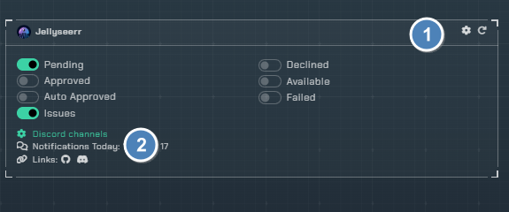
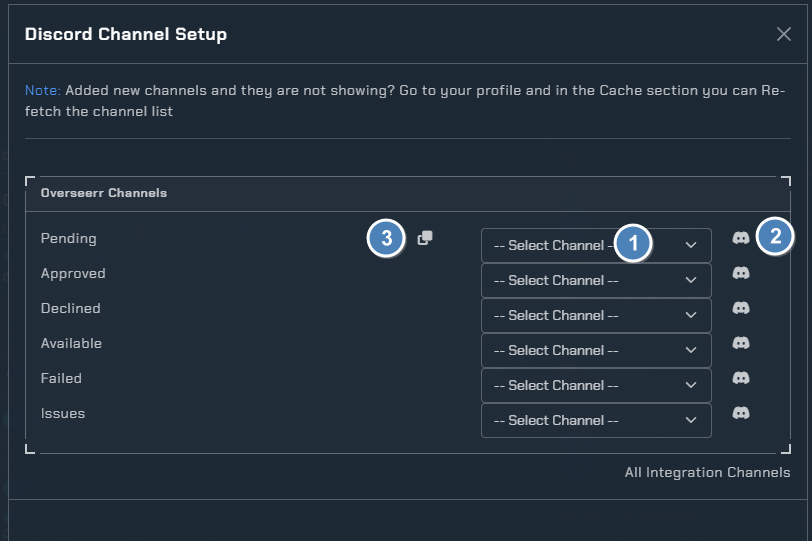
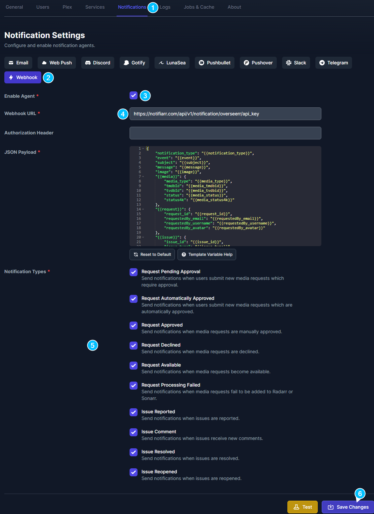

# Jellyseerr

!!! question "jellyseerr notifications"
    If you have any issues setting up notifications for jellyseerr refer to this [wiki](https://docs.jellyseerr.dev/using-jellyseerr/notifications)

---

## Integration Card

1. Configuration
2. Channel picker for the notifications

---

### Channel Picker

1. List of channels `Dropdown menu`
2. Test bot channel permissions
3. Copy Channel to all

---

## Configuration

1. Notification triggers
2. Notification Options
3. Notification Color

!!! note
    **Be sure to save settings**

---

## Instructions

1. Notifications Settings
2. Webhook
3. Enable the webhook agent
4. Add the notification URL `https://notifiarr.com/api/v1/notification/overseerr/api_key_here` - Make sure to make a api key specific to overseerr
5. Notification types you want to receive
6. Save changes and enable the webhook
