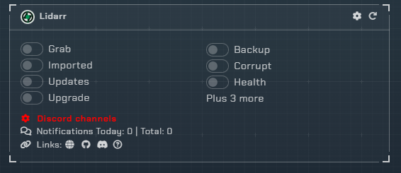
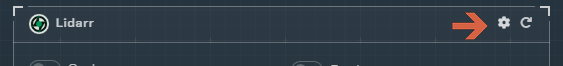
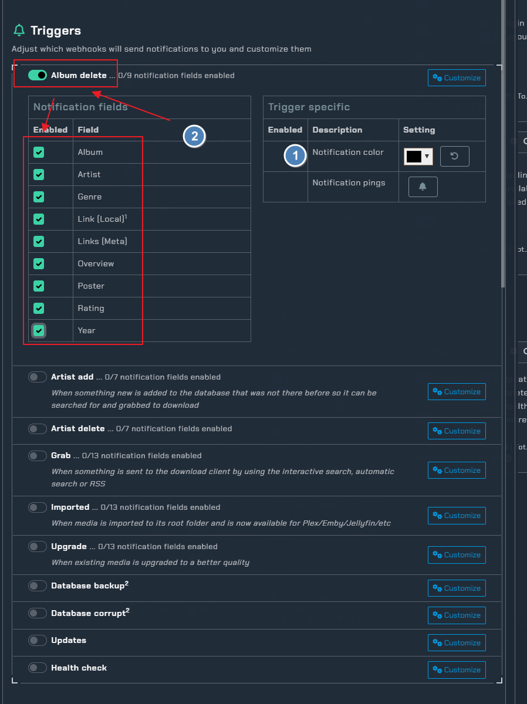
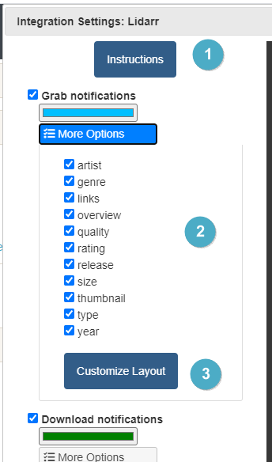
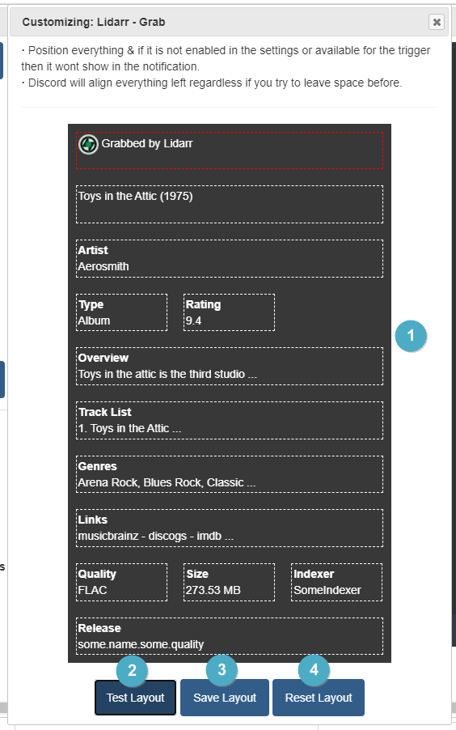
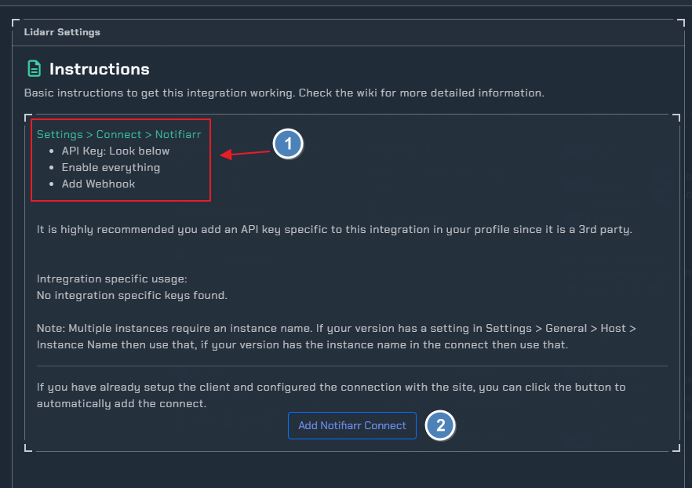

!!! info "Lidarr"
    This integration allows for notifications from Lidarr using its built in Connection for **Notifiarr**. In Lidarr click Settings → Connect → <kb>+</kb> → Notifiarr

### Current Versions

{ .off-glb } { .off-glb } { .off-glb }

---

## Trigger options

### Triggers

- `Grab` - Receive a notification when media is initially grabbed (RSS or manual)
- `Download` - Receive a notification when media **new** is successfully imported
- `Update` - Receive a notification when the application updates
- `Upgrade` - Receive a notification when **upgraded** media is successfully imported
- `Failed` - Custom notification type based on previous grabs. If the system detects a grab for the same media with the same quality or better before the previous one was imported then it will set the previous one as failed
- `Health` - Receive a notification when the application reports an issue
- `Backup` - Receive a notification when a backup occurs 
- `Corrupt` - Monitor backups for corruption and size loss 
- `Deleted` - Be notified when media is deleted

### Channel

- Lidarr shares the *arr channel unless Granular Setup is used, clicking the link on the site will move to the channel setup location.

---

## Configuration

Click the **cog icon** to open the configuration options for Lidarr.

1. Open integration specific instructions
1. Notification colors for each trigger type
1. Unique notifications: Generate a new notification each time (By default notifications edit the previous one so there is a Grab and then the Download ot Upgrade will edit the Grab notification to alleviate the notification spam)

1. Open integration specific instructions
1. Notification content options that you can turn on/off to show in the notifications
1. Launch the integration layout editor (image below)

1. Drag and drop positioning of where you want to see each piece of information in the notification. Some fields are locked (red outline). Full width items can not be used in a multi-line layout. You can not have more than 3 items per line.
1. Test Layout - Will send a test notification with the current layout format
1. Save Layout - Will save the current layout format as the one you want to use
1. Reset Layout - Will set the layout back to default

### Instructions

1. How to enable notifications from within Lidarr
1. Test the notification from Notifiarr to Discord
    - This will ensure your server, channel and permissions are set properly in Discord.

### Errors

#### 400 Bad Request

Check and ensure you have a Grab or Download channel configured for Lidarr

#### 401 Unauthorized

Your APIKey is incorrect
