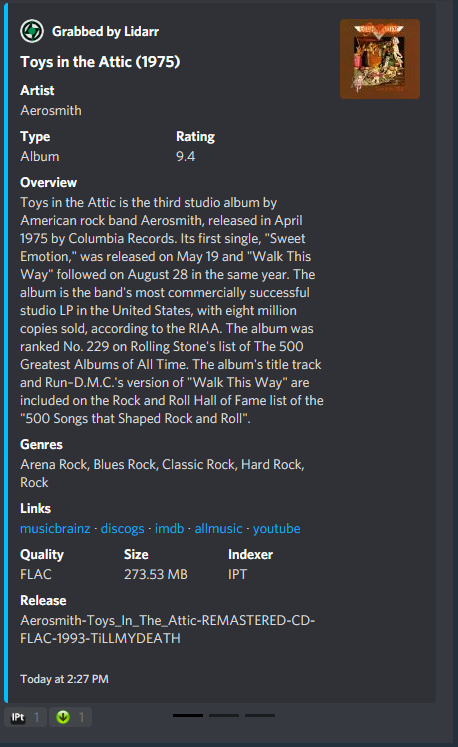

# Lidarr

!!! info "Lidarr"

    This integration allows for notifications from Lidarr using its built in Connection for **Notifiarr**. In Lidarr click Settings &rarr; Connect &rarr; Notifiarr

## Current Versions

{ .off-glb } { .off-glb } { .off-glb }

---

## Trigger options

---

### Triggers

- `Grab` - Receive a notification when media is initially grabbed (RSS or manual)
- `Download` - Receive a notification when media **new** is successfully imported
- `Update` - Receive a notification when the application updates
- `Upgrade` - Receive a notification when **upgraded** media is successfully imported
- `Failed` - Custom notification type based on previous grabs. If the system detects a grab for the same media with the same quality or better before the previous one was imported then it will set the previous one as failed
- `Health` - Receive a notification when the application reports an issue
- `Backup` - Receive a notification when a backup occurs
- `Corrupt` - Monitor backups for corruption and size loss
- `Deleted` - Be notified when media is deleted

---

### Channel

- Lidarr shares the *arr channel unless Granular Setup is used, clicking the link on the site will move to the channel setup location.

---

## Instructions

---

## Configuration

Click the **cog icon** to open the configuration options for Lidarr.

1. set the notification color
2. enable trigger in this example we used `album delete` and selected all available fields

---

## Example

here is a example if we enable all notification fields under the `grab` trigger

### Errors

#### 400 Bad Request

Check and ensure you have a Grab or Download channel configured for Lidarr

#### 401 Unauthorized

Your APIKey is incorrect
