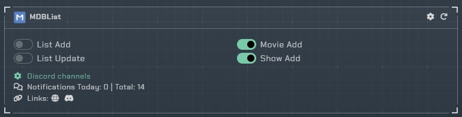
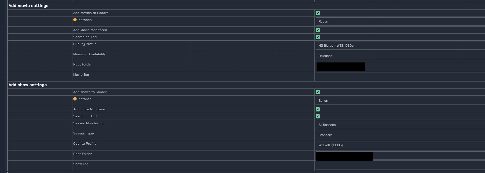

# MDBList

## What is MDBList

MDBList is a 3rd party service that allows you to curate lists of shows and movies from various sources and [can be found here](https://mdblist.com), this integration is meant to do three things:

1. Allow for the ability to add individual shows or movies to Radarr or Sonarr using the add button on the show item on the MDBList website

2. Sync lists created on MDBList into Sonarr and Radarr automatically. (this is currently not functioning and provides an error “*The list was not automatically added to Sonarr because it does not support generic lists. You'll have to add it as a Trakt list and authenticate inside of Sonarr.*" which has been reported)
3. Sync a list of IDs from your local collection to MDBList which can be used within the filtering of a list, to exclude, for example, all collected shows or movies.

## **Prerequisites:**

1. Notifier setup with and working with Discord, Sonarr, and Radarr integrations
2. Account with MDBList
3. API key created on the Notfier website and assigned for use with MDBList, this can be generated and found in your profile, under the API Keys section
4. Notifier API key allocated to the MDList integration added to your profile under preferences\Notifiarr on MDList and enable “Automatically add lists to Radarr (if configured in Notifiarr)"

## **Steps to configure integration:**

1. From within the notifier website add the MDBList integration
2. Configure your discord channels
3. Enable "Movie Add" and "Show Add" by enabling the toggles as shown below.

We now need to configure some additional settings from within the integration, to tell Notifiarr what settings to use when adding a movie or show.

Edit the MDBList integration, scroll down to the Extra settings modify the add movie and add show settings and save:

1. Add Movie/Shows to Radarr/Sonarr = Enabled
2. Select the instance for notifiarr to use
3. Add as monitored
4. Search on add
5. Minimum Availability
6. Root folder

When setup how you like, select save. When you now find a show or movie on MDBList, you have the option to add to Radarr and Sonarr, the above enables that. You will find it is added to the instance and a search takes place imediately.

