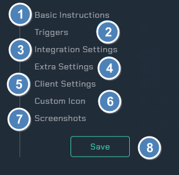

# network

!!! info

    This integration allows for notifications from the local Notifiarr client app to monitor network machines or services.

## Network Overview

1. Reloads the integration.

2. Opens the integrations settings.

3. A list of everything you are monitoring with the Notifiarr client and show a green arrow if it is available or red arrow if it isn't.

4. Opens up the Discord channel selection menu.

## Integration Settings Menu

Click the **cog icon** to open the integration settings for the Network integration.

1. `Basic Instructions` - Gives you basic guidelines on how to setup this integration in the UI.

2. `Triggers` - Adjust which webhooks will send notifications to you.

3. `Integration Settings` - Allows the user to further configure the integration.

4. `Extra Settings` - Adjust the extra settings for this integration.

5. `Client Settings` - Allows the user to set the scanning interval.

6. `Custom Icon` - Assign another icon to notifications from this integration. (Subscriber Feature)

7. `Screenshots` - Shows the expected output once all correctly configured.

8. `Save` - Saves all your Configured settings and closes the Integration Settings Menu.

## Basic Instructions

Detailed instructions are shown in the Client UI section of the wiki.

1. `Service Checks` - Allows the user to configure the destination service and type of check to be done. (Do not add any of your starr applications here)

2. `+` - Adds additional line items.

## Integration Settings

These are all the configurable options available to the user.

## Triggers

Here you can select individual color schemes for each available trigger.

## Integration Settings (Monitor Settings)

1. `Order` - This is the order of your services, you cant change this here. You will need to use `groups` (this is covered in the next section below).

2. `Ping` - Enable this to ping the selected role when the corresponding service goes into a down status.

3. `Pick a role` - This is where you can pick the role you want to receive the ping.

4. `Cron` - Enabling the cron will post a status message of the currently selected services. (this will follow the `Service Status (Cron)` interval that you set).

5. `Exclude Notify` - This will allow you to exclude the selected services from sending notifications about its status.

6. `Exclude Status` - This will exclude the service from showing on the `Status Page`.

7. `Services` - This tells you the name of your services.

8. `Type` - This tells you the type of service such as `HTTP`.

9. `Status` - This gives the services current status.

## Integration Settings (Status page)

1. `Status Page` - Enables a web page status overview of all your monitored items. Past events are also shown. (This requires a API set for the network integration)

2. `Website Status` - Include current status of websites being tracked with the Website Status integration.

3. `Customization (Patron Feature)` - Patrons/Subscribers can use this area to create service groups.

4. `Group name` - Here you can set the desired group name.

5. `Monitors` - Choose the services you want in the group.

6. `New group` - Here you can create another group, so for example if i wanted a group for all my download clients called `download_clients` and another group for my `Starr_applications` this is how we can achieve this.

7. `Trash can` - This will delete the group.

## Client Settings

1. `Mute Client Down Alerts` - Select this to stop down alerts.

2. `Interval` - Select from the drop down list to select the check time in minutes. Or to disable all checks.

3. `Save Client Settings` - Make sure to save the client settings. (this is different from the top save button)

## Examples

