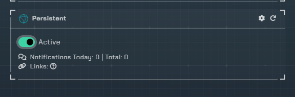
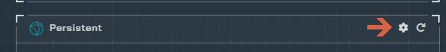
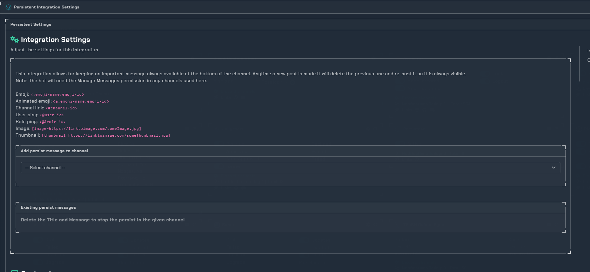

# Persistent

!!! info
     This integration allows for notifications to always stay in the channel. Anytime someone posts, it will remove its previous post and re-add it to the bottom of the channel.

## Trigger options

1. Triggers
    - `Active` - Enable notifications

---

## Configuration

Click the **cog icon** to open the configuration options for Persistent messages.

- Pick the channel you want to add a persistent message to and give it a title with a message.
