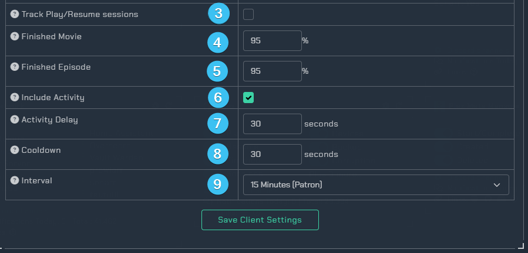

# Plex

!!! info
    This integration allows for notifications from Plex. Keep in mind this utilizes the [Notifiarr client](../../pages/client/install.md)

## Current Version

{ .off-glb }

Reaction example:

## Plex Trigger Overview

1. Opens the integrations settings.
1. Reloads the integration.
1. Triggers
    - `Play` - Notify when a user starts playing media.
    - `Resume` - Notify when a user resumes playing media.
    - `Finished` - Notify when a user finishes playing media.
    - `Rating` - Notify when a user rates a movie/show.
    - `New Item` - Notify when a new item is added to plex (requires push notifications enabled in Plex - Server -> General).
    - `Sessions` - Get notifications about streaming sessions and minimal server information.
    - `Devices` - Notify when a new device is added.
    - `Backup` - Notify when a backup was completed.
    - `Corruption` - Notify when database corruption is detected.
1. Discord Channels
    - Channel(s) to use for sending plex notifications.

## Integration Settings Menu

Click the **cog icon** to open the integration settings for Plex.

1. `Basic Instructions` - Gives you basic guidelines on how to setup this integration in the UI.
1. `Triggers` - Adjust which webhooks will send notifications to you.
1. `Integration Settings` - Allows the user to further configure the integration.
1. `Extra Settings` - Adjust the extra settings for this integration.
1. `Client Settings` - Allows the user to set the scanning interval.
1. `Custom Icon` - Assign another icon to notifications from this integration. (Subscriber Feature)
1. `Content Lines` - Add a message to the top of notifications for wearable/toast purposes.
1. `Screenshots` - Shows the expected output once all correctly configured.
1. `Save` - Saves all your Configured settings and closes the Integration Settings Menu.

### Triggers

1. Notification triggers.
1. Notification fields - Select various fields to be displayed in the notification.
1. Notification colors.

### Integration Settings

Here you can adjust the settings for this integration.

#### User/Device

1. Table of all users and devices. Uncheck the notify box to not receive notifications from the specific user/device.
1. Keyword for having the bot display what is currently streaming on your server.

#### Session Management

1. `Scope` - Kill all sessions from a given user/device (Maybe a user shared their login with someone else).
2. `Rules` - Kill the session after rules have been met.
3. `Action` - Notify when sessions are automatically killed.

#### Library Trash

*Note: You may see the following error when tab is loading: `Error fetching plex library list.` Ensure the [client settings](#client-settings) are saved and try again.*

1. `Trigger` - Keyword to trigger a cleanup outside the set frequency and time
2. `Library` - Check which libraries you want the automated trash cleanup
3. `Trash Settings` - The time and frequency of the automated cleanup
    - `Frequency` - How frequently this should try to clear the trash.
    - `Time` - What time of day this should try to clear the trash.
    - `Max` - Do not empty if trash items is more than this number (in case of a drive failure for example).
    - `Copy` - Copy applied settings to all libraries. *Note: This only appears on the first listed library.*
4. `Times` - The times for the library

### Extra Settings

Additional settings such as automatically unmonitor an episode or movie once a user has watched it. You are able to select multiple users by holding down ctrl and highlighting the names.

### Client Settings

1. `Account Map` - This will map user emails in your notifications to a user friendly name.

1. `Plex and Tautulli Account Map` - Examples of mapped accounts.
1. `Track Play/Resume sessions` - Check this if you want to get Play/Resume notifications but do not have a Plex Pass.
1. `Finished Movie` - This is a percentage setting for when to send a finished playing movie notification, 0 to disable, 70 min and 95-98 suggested.
1. `Finished Episode` - This is a percentage setting for when to send a finished playing episode notification, 0 to disable, 70 min and 95-98 suggested.
1. `Include Activity` - This is a used to send speed, transcode, container, etc information in plex notifications.
1. `Activity Delay` - This is how long to wait after media is started before getting the session, at least 10-12 seconds is needed.
1. `Cooldown` - Minimum time between notifications to ensure duplicates are not sent (such as media.play and playback.started)
1. `Interval` - This is how often to send a notification for the Plex Sessions trigger, nothing sends if there is no media playing or paused.

### Custom Icon

Assign another icon to notifications from this integration (Subscriber Feature)

### Content Lines

Content lines are small previews of the full notification for toast/push notifications. Great for wearables.

## Instructions

This integration requires the Notifiarr client to be running locally. You can get it from [Github](https://github.com/Notifiarr/notifiarr/releases). After installing, you need to setup plex in the UI. An example is

1. The name for Plex comes from Plex and cannot be changed here. There is no automatic way to add a service check to Plex. If you want service checks, add one for it in Service Checks.
1. `http://` or `https://` URL for the application instance. If your application has a Base URL, include it. Providing an https:// URL reveals a checkbox. Checking this box enables SSL certificate validation; invalid certificates generate an error.
1. Your Plex Token you may find directions for locating your Plex token at this [Plex Article](https://support.plex.tv/articles/204059436-finding-an-authentication-token-x-plex-token/).
1. This controls the maximum duration a request to this application may elapse. Selecting No Timeout can be dangerous. Selecting Disabled completely disables the instance.

### Webhook

!!! info
    [Plex Webhooks](https://support.plex.tv/articles/115002267687-webhooks/) from Plex to the Client require
    [Plexpass](https://www.plex.tv/plex-pass/)

In Plex, [add a webhook](https://app.plex.tv/desktop/#!/settings/webhooks) that points to `http://localhost:port/plex?token=plex-token-here`

- Replace `localhost:port` with the `ip:port` to the Notifiarr client
- Replace `plex-token-here` with the token for Plex so the Notifiarr client allows the incoming connection

