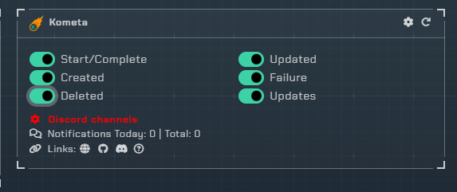

# Kometa

## Website

To enable Kometa support on the site, open the Plex integration and you will find the Kometa triggers and color settings.

Open the Plex channel picker and you will see a channel setting for `Collections`. Any errors will automatically be sent to the shared error channel.

## Webhook Types

!!! info

     As of December 2022, this integration can send 5 webhooks. You can either activate them by ticking the on/off buttons or clicking on the gear icon where you can pic your notifications’ colours as well.



- `Start/Complete`: Sends a notification every time Kometa runs and finishes its run.
- `Updated`: Sends a notification whenever a collection changes, whether an item is added or removed. They can be sent at the same time as well. Notifiarr will show a maximum of 10 items and will sum up the rest according to their number.
- `Created`: Sends a notification whenever a Kometa collection is created.
- `Failure`: Sends a notification whenever there’s an error inside your Kometa configs. For more information you would have to look at your Kometa logs. This notification is sent to the default notifiarr error channel.
- `Deleted`: Sends a notification whenever a Kometa collection is removed.
- `Updates`: Sends a notification whenever there's a new Kometa version available.

## Client

The Notifiarr client on your local machine is not required for this integration to work. Kometa is webhook based.  It is highly recommended you add an API key specific to this integration since it is a 3rd party.

## Kometa Config File

In order to activate Notifiarr on Kometa, you need to edit the yml config file and add the following:

```yml
notifiarr:
 apikey: YOURKEY
```

Kometa is web-hook agnostic hence you need to instruct it where to send the webhooks. Inside the config file edit the following:


```yml
webhooks:
  error: notifiarr
  version: notifiarr
  run_start: notifiarr
  run_end: notifiarr
  changes: notifiarr
```

It's always good to run a yml validator if you are not sure if your file will be a valid one. Then make sure to restart Kometa in order for new changes to take effect.

## Misc

If you would like Notifiarr to include your Collections’ pictures and background, you can include `url_background` and/or `url_poster` inside your PMM library’s yml file and notifiarr will grab them and include them within the notification, making them look nicer.
