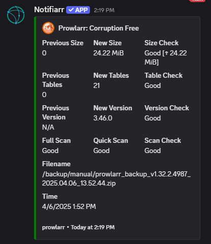

# Prowlarr

!!! info

     This integration is for setting up discord notifications for Prowlarr

## Trigger options

- `Updates` - Notification for prowlarr updates available
- `Health` - Notification for health errors
- `Health Restored` - Notification for health status restored to normal
- `Grab` - Notification for grabs
- `Backup` - Notification for when backups occur
- `Corrupt` - Notification for corrupted database

---

## Instructions

!!! note

    For help with prowlarr please visit there [wiki](https://wiki.servarr.com/prowlarr)

- Click the cog icon too open the settings

1. Instructions on how to setup the notifiarr connect in prowlarr
2. If you already have the client setup and configured use the `Add Notifiarr Connect` too automatically add the connect to prowlarr.

!!! info

    We can see the connect has been added via Prowlarr &rarr; Settings &rarr; Notifications &rarr; Connections You should also have gotten a test notification

Prowlarr Connect            |  Test Notification
:-------------------------:|:-------------------------:
  |  

---

## Configuration

1. click the `Customize` toggle to open the trigger settings.
2. Choose the color of your notifcation

- here are all the avialable `Notification Fields` under the `Grab` trigger as you can see there is alot of customization for your specific needs :smile:

---

### Examples

Prowlarr Grab          |  Prowlarr Corruption
:-------------------------:|:-------------------------:
  |  
