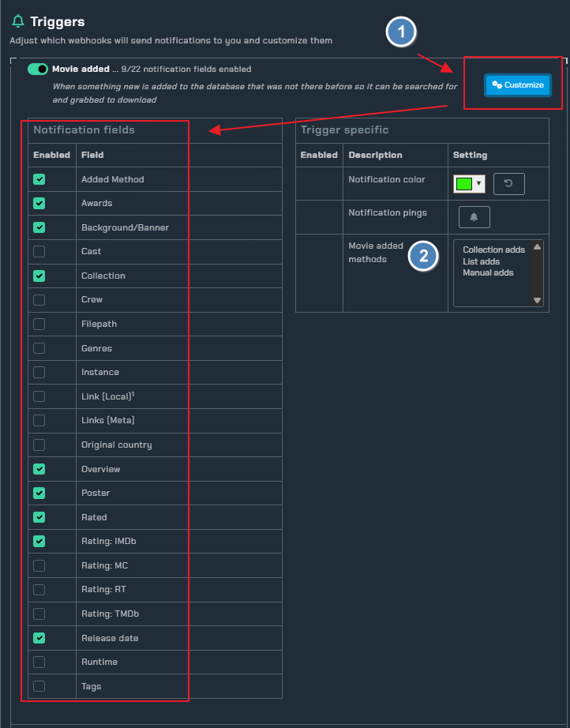

!!! info
     This integration allows for notifications from Radarr using its built in Connection for **Notifiarr**. In Radarr click Settings → Connect → <kb>+</kb> → Notifiarr

---

## Trigger options

### Triggers

- `Movie Added` - Receive a notification when media is added to Radarr
- `Grab` - Receive a notification when media is initially grabbed (RSS or manual)
- `Download` - Receive a notification when media **new** is successfully imported
- `Upgrade` - Receive a notification when **upgraded** media is successfully imported
- `Deleted` - Be notified when media is deleted
- `Update` - Receive a notification when the application updates
- `Backup` - Receive a notification when a backup occurs 
- `Corrupt` - Monitor backups for corruption and size loss
- `Failed` - Custom notification type based on previous grabs. If the system detects a grab for the same media with the same quality or better before the previous one was imported then it will set the previous one as failed
- `Health` - Receive a notification when the application reports an issue

### Channel

- Radarr Channel picker for each trigger

---

## Configuration

Click the **cog icon** to open the configuration options for Radarr.

1. Basic instructions on how to add Notifiarr to Radarr
2. Trigger options and colors for the notification
3. Custom icon (Subscriber feature)
4. An optional content line added to notifications for mobile/wearable devices
5. Sends an overview once a day of your Radarr history
6. Custom regular expression option to exclude health checks that match
7. Minimum size difference between backups to warn of file size changing
8. Option to only send notifications if corruption detects a warning or error
9. Option to stop notification updating and send a notification for everything
10. Option to delete the grab notification after the import notification is received
11. Automatically unmonitor grab loops and notify about it. Requires a valid connection to Radarr with the client. Patron feature.
12. Send notifications with selected ratings (considered 'adult') to another channel

### Notification Content

1. Notification content options that you can turn on/off to show in the notifications
1. Launch the integration layout editor (image below)

### Layout Editor

1. Drag and drop positioning of where you want to see each piece of information in the notification. Some fields are locked (red outline). Full width items can not be used in a multi-line layout. You can not have more than 3 items per line.
1. Test Layout - Will send a test notification with the current layout format
1. Save Layout - Will save the current layout format as the one you want to use
1. Reset Layout - Will set the layout back to default

## Instructions

## Errors

#### 400 Bad Request

Check and ensure you have a Grab or Download channel configured for Radarr

#### 401 Unauthorized

Your APIKey is incorrect
