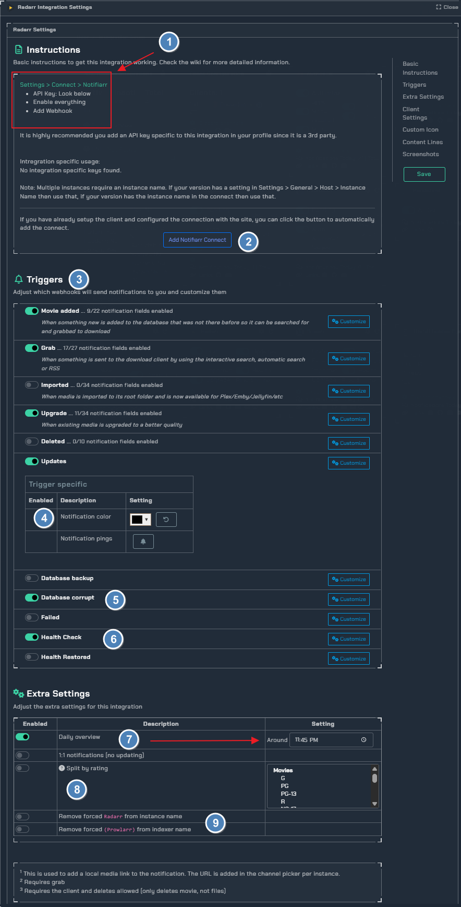

!!! info
     This integration allows for notifications from Radarr using its built in Connection for **Notifiarr**. In Radarr click Settings → Connect → <kb>+</kb> → Notifiarr

---

## Current Versions

{ .off-glb } { .off-glb } { .off-glb }

## Trigger options

### Triggers

- `Movie Added` - Receive a notification when media is added to Radarr
- `Grab` - Receive a notification when media is initially grabbed (RSS or manual)
- `Download` - Receive a notification when media **new** is successfully imported
- `Upgrade` - Receive a notification when **upgraded** media is successfully imported
- `Deleted` - Be notified when media is deleted
- `Update` - Receive a notification when the application updates
- `Backup` - Receive a notification when a backup occurs 
- `Corrupt` - Monitor backups for corruption and size loss
- `Failed` - Custom notification type based on previous grabs. If the system detects a grab for the same media with the same quality or better before the previous one was imported then it will set the previous one as failed
- `Health` - Receive a notification when the application reports an issue

### Channel

- Radarr Channel picker for each trigger

---

## Configuration

Click the **cog icon** to open the configuration options for Radarr.

1. Basic instructions on how to add Notifiarr to Radarr
2. If you have already setup the client and configured the connection you can use this too automatically add the connect
3. all available triggers 
4. Trigger specific color selector in this example trigger `updates` uses the color black
5. Use this to be notified if your database is corrupted
6. Get notified of health status 
7. Set a daily overview of radarr and a set time of day
8. Send notifications with selected ratings (considered 'adult') to another channel
9. Use this too remove `forced` instances.

### Notification Content

1. Use the `customize` toggle too drop down all available notification fields in this example we use `movie added`
2. Select if you want too know how the movie was added

## Examples 

grabbed example             |  update example
:-------------------------:|:-------------------------:
  |  

## Errors

#### 400 Bad Request

Check and ensure you have a Grab or Download channel configured for Radarr

#### 401 Unauthorized

Your APIKey is incorrect
