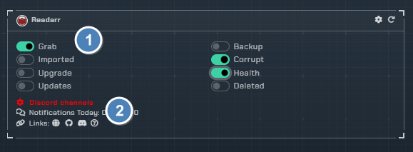
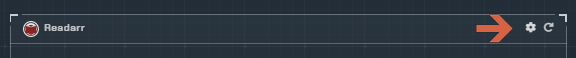
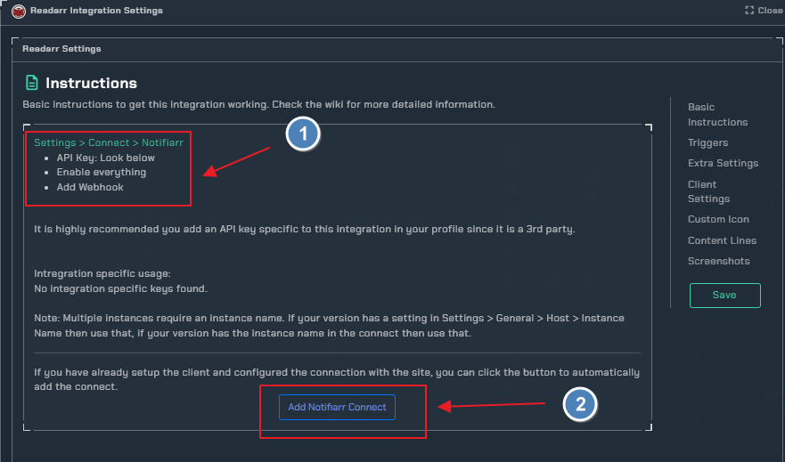
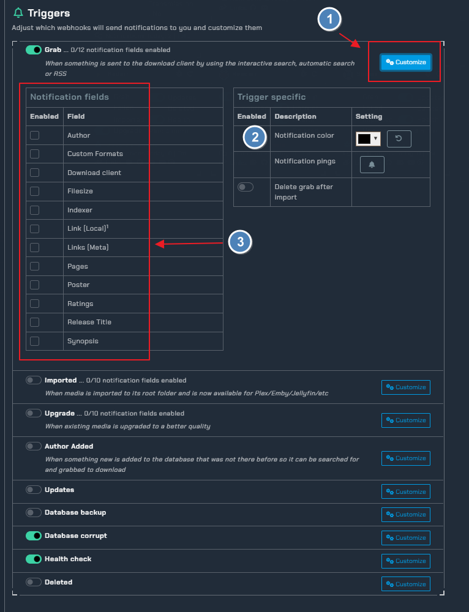

# Readarr

!!! info

    This integration allows for notifications from Readarr using its built in Connection for **Notifiarr**. In Readarr click Settings → Connect → <kb>+</kb> → Notifiarr

---

## Trigger options

### Triggers

- `Grab` - Receive a notification when media is initially grabbed (RSS or manual)
- `Download` - Receive a notification when media **new** is successfully imported
- `Update` - Receive a notification when the application updates
- `Upgrade` - Receive a notification when **upgraded** media is successfully imported
- `Health` - Receive a notification when the application reports an issue
- `Backup` - Receive a notification when a backup occurs
- `Corrupt` - Monitor backups for corruption and size loss
- `Deleted` - Be notified when media is deleted

---

### Channel

- Readarr shares the *arr channel unless Granular Setup is used, clicking the link on the site will move to the channel setup location.

---

## Configuration

Click the **cog icon** to open the configuration options for Readarr.

---

### Instructions

1. How to enable notifications from within Readarr
2. Automatically add the connect if the client is setup

---

## Integration Instructions

1. Use the `Customize` toggle too drop down
2. Set the color of the notification
3. All available `notification fields` in this case we used the `grab` trigger

---

### Errors

#### 400 Bad Request

Check and ensure you have a Grab or Download channel configured for Readarr

#### 401 Unauthorized

Your APIKey is incorrect
