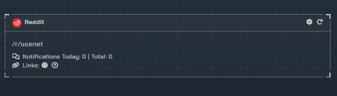
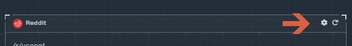

!!! info
    This integration allows for notifications from subreddits you choose to watch

---

## Monitoring overview

This will list all subreddits you are monitoring.

---

## Configuration

Click the **cog icon** to open the configuration options for the Reddit integration.

1. `Select Channel` - Pick a channel for the subreddit notification to go to.
1. `Subreddit Config` - Either enter in the subreddit or custom domain. After which you can include or exclude key words using Regex.
1. `Add Reddit Monitoring` - Add the subreddit to your account to monitor.
1. `Channel Editor` - Edit the channel of an existing monitored subreddit.
1. `Edit Existing Subreddit` - Edit your existing subreddit config.
1. `Update/Delete` - Save or remove the modified subreddit from being monitored.
