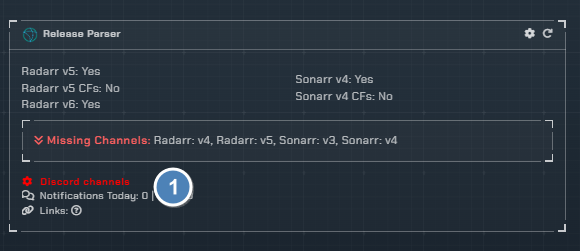
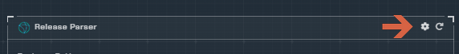
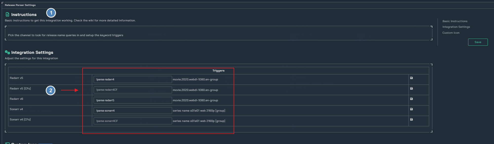

# Release Parser

!!! info

    This integration allows for users to parse a release name in the same method Radarr and Sonarr do to see how the name will be treated.

## Trigger options

- Select the channel to monitor for releases to be checked

---

## Configuration

Click the **cog icon** to open the configuration options for the Release parser.

## Instructions

1. basic instructions
2. Pick the keywords that the bot will watch for
