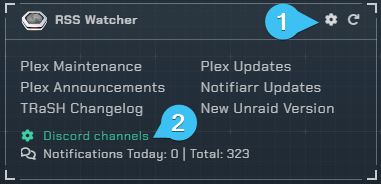
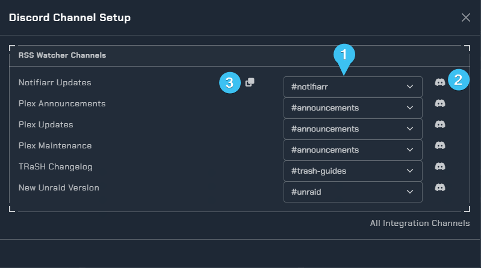
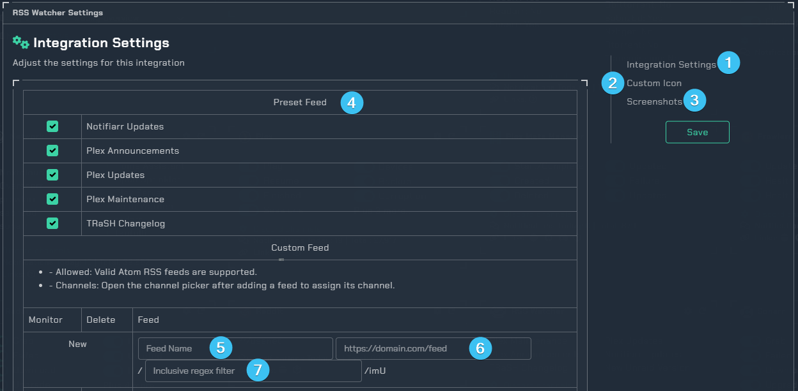

# RSS Watcher

## Integration Card

1. Configuration
2. Channel picker for the feeds

### Channel Picker

1. List of channels `Dropdown menu`
2. Test bot channel permissions
3. Copy Channel to all

## Configuration

1. Page to configure the RSS Watcher.
2. Custom Icon `Subscriber Feature`
3. Example screenshots of what you can expect the notification to look like.
4. List of preset RSS feeds you can toggle on to get notifications from
5. Name of custom feed
6. URL for the RSS feed you wanna add
7. regex filter of things to post
