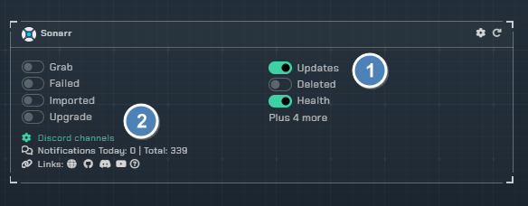
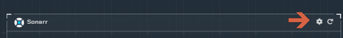
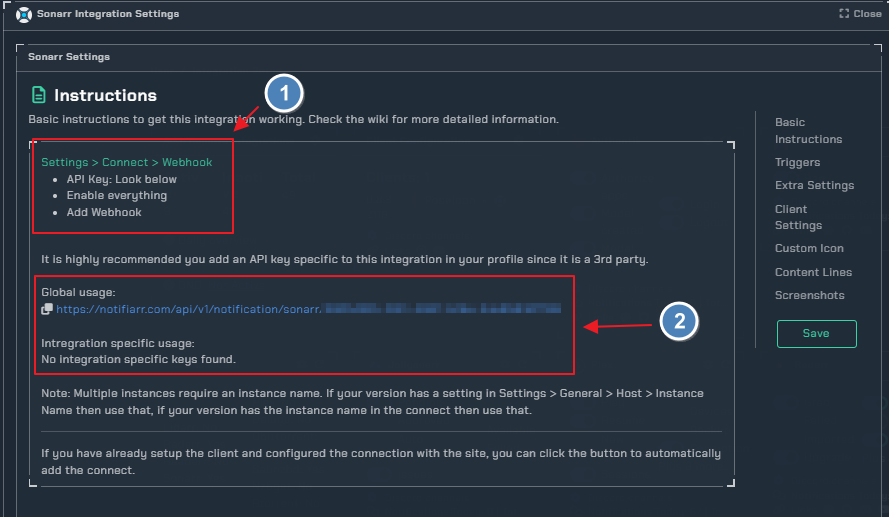
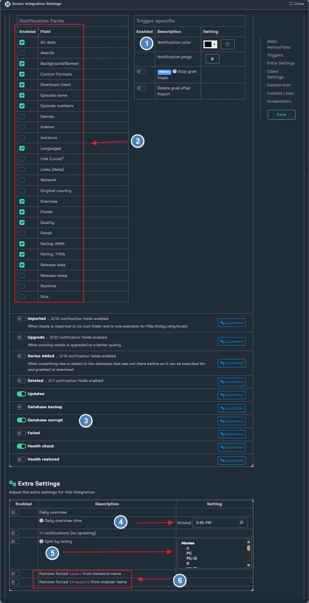
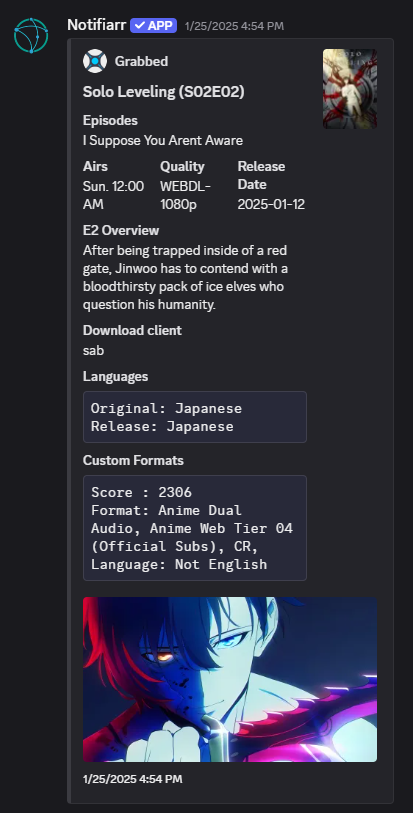
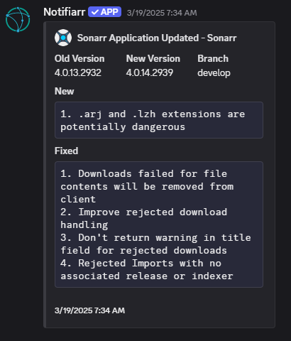

# Sonarr

!!! info
    This integration allows for notifications from Radarr using its built in Connection for Notifiarr. In Radarr click Settings → Connect → + → Notifiarr

## Current Versions

{ .off-glb }
{ .off-glb }

## Trigger options

### 1. Triggers

- `Grab` - Receive a notification when media is initially grabbed (RSS or manual)
- `Download` - Receive a notification when media **new** is successfully imported
- `Upgrade` - Receive a notification when **upgraded** media is successfully imported
- `Deleted` - Be notified when media is deleted
- `Update` - Receive a notification when the application updates
- `Backup` - Receive a notification when a backup occurs
- `Corrupt` - Monitor backups for corruption and size loss
- `Failed` - Custom notification type based on previous grabs. If the system detects a grab for the same media with the same quality or better before the previous one was imported then it will set the previous one as failed
- `Health` - Receive a notification when the application reports an issue

### 2. Channels

- Sonarr channel picker for each trigger

## Configuration

Click the **cog icon** to open the configuration options for Sonarr.

### Instructions

1. In Sonarr navigate to Connect => Add New (Plus Button) => Webhook
2. Enter the webhook URL in the URL field
Enter a name for the Notification in Sonarr `Notifiarr` is suggested, but use what you like
Enable the notification triggers you wish to have sent from Sonarr to the Notifiarr Site
Hit test - you should receive a notification on discord with the test message from Sonarr
Save

## Integration instructions

1. Notification color selector
2. all `notification fields` available under `grabbbed` trigger
3. Notification for corrupted database
4. Sends an overview once a day of your Sonarr history at your specified time
5. Send notifications with selected ratings (considered 'adult') to another channel
6. Options to remove `forced` from instances/indexer name

## Examples

grabbed example             |  update example
:-------------------------:|:-------------------------:
  |  

### Errors

#### 400 Bad Request

- Check and ensure you have a Grab or Download channel configured for Sonarr (Test notifications try to use Grab, then Download to send, you can disable after the test if you want)
- Ensure the webhook URL is accurate

#### 401 Unauthorized

Your APIKey is incorrect
