# TRaSH

!!! info "TRaSH"

    This integration allows you to setup and sync TRaSH guides with Radarr and Sonarr. Keep in mind this requires the Notifiarr client.

!!! warning "patrons/subscribers"
    **Patron Feature** - Acessible to [Patrons and Subscribers](../../pages/faq/faq.md#q-what-are-the-user-level-differences) only

!!! warning
    This is notifiarr NOT TRaSH Guides. If you have any issues settings up TRaSH please use their [discord](https://trash-guides.info/discord) for help :smile:

## Client Setup

- TRaSH Integration requires the notifiarr client to be running locally, [configured and working (i.e. communicating with) on the Notifiarr site](../../pages/website/clientConfig.md), and the Starr Apps configured.
- Add Starr Apps to the Client in the `Starr Apps` Tab of the Local Client
  - Note that `Time Out` for the Starr Apps **cannot** be set to `Disabled` for the app to be enabled
  - Note that a `Name` value **is required** for the Starr Apps you wish to sync

### Integration Card

1. Sync
    - The amount of CF's and scores you have in sync
1. Channel
    - Which channel to send TRaSH update notifications to (when TRaSH updates them, removes them, when you sync them or unsync them)

## Getting Started

Click the **cog icon** in the card header to open the configuration options for TRaSH. To get started, you will need to go to Help → How-to.

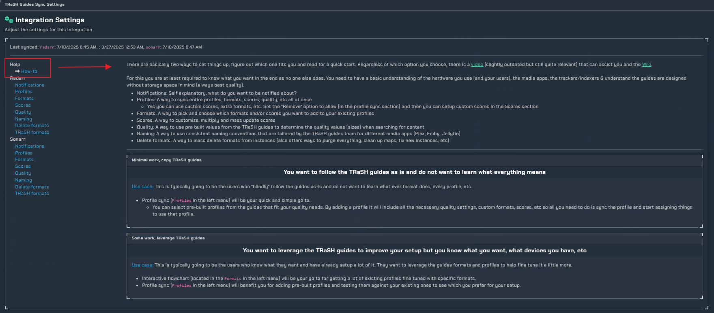

## Client Settings

here you can change the interval for your sync

### Notifications

Here we can individually set what we would want to be notified for.

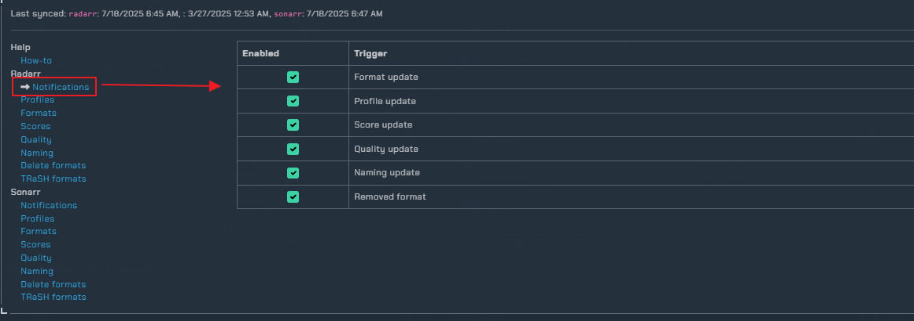

### Profiles

here we can manange existing profiles or add new profiles/link predefined TRaSH profiles. For this guide we are going too add the TRaSH **HD Bluray + WEB** profile

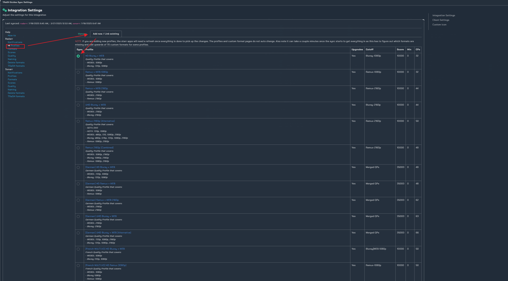

!!! info
    After selecting the profile as shown above you will be directed to the profile settings.

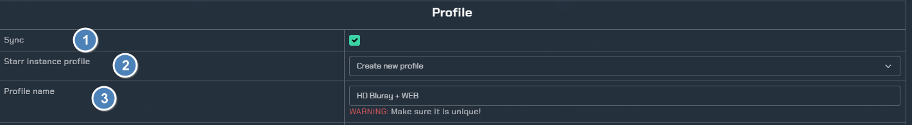

1. syncing the profile.
2. if you want to create a new profile, or overide a existing profile.
3. profile name **Needs to be unique**.

!!! Note
    If you plan too use TRaSH as default you can stop here and save your settings. Below we will got into customizing the profile, quality, and CF's.

!!! warning SAVE PROFILE SYNC
    **MAKE SURE TO SAVE YOUR PROFILE SYNC, THIS IS DIFFERENT FROM SAVE CLIENT SETTINGS**

### Profile Customization

!!! info
    Check-box means you want too sync TRaSH values and cannot change them in your ARR's as they will revert back after each sync is made. Uncheck any that you want too customize, And do so inside of your ARR's.

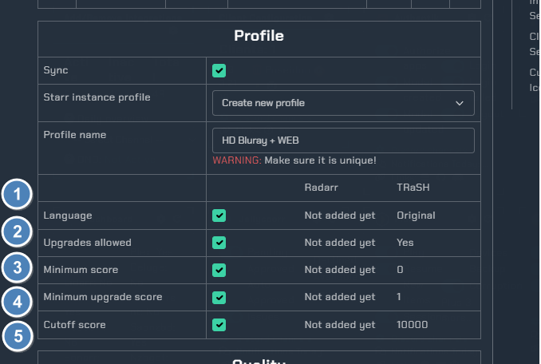

1. if you want too sync the language.
2. if you want too allow upgrades.
3. minimum allowed score to download.
4. minimum upgrade score, meaning if your current file has a score of 200 it will upgrade to a file with a score of 201 if it becomes available unless you have met your cutoff quality.
5. quality cutoff met.

### Quality Settings

!!! warning
    If you plan on changing the qualities in the profile, you will need to enable the allow custom quality order/groupings, if this is not enabled any changes made to the quality grouping will be reverted after each sync.

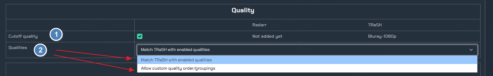

1. Quality cutoff.
2. If you want to match TRaSH qualities, or allow for custom qualities.

### Custom Formats "CF"

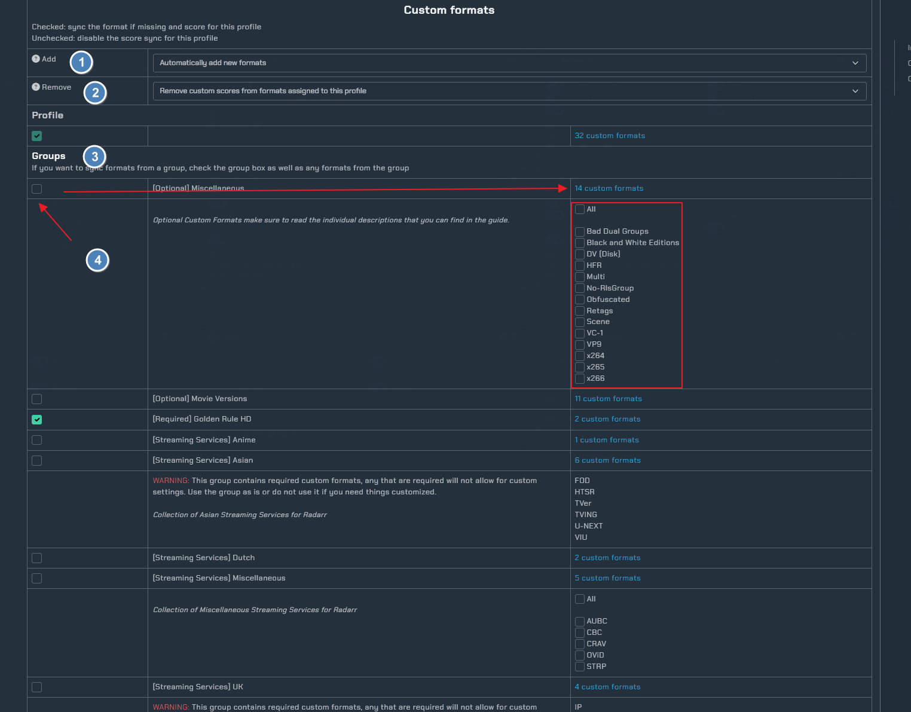

1. Choose if you want all new formats automatically added, only add missing formats, or add no formats.
2. Remove cf scores from this profile, or allow cf scores for this profile.
3. All available cf groups.
4. You can enable a grouping and choose the dropdown for all available cf's in the group.

### Formats

!!! info
    Here you will find all of the available TRaSH guide formats. You can find more info on these at [TRaSH Guides](https://trash-guides.info/)

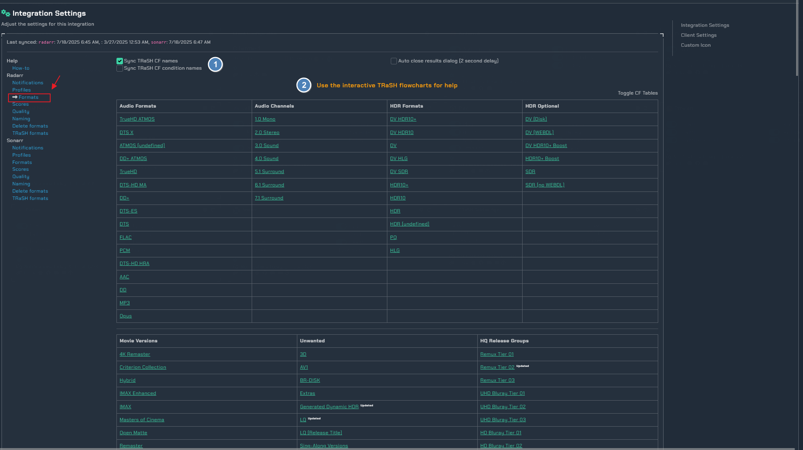

1. Syncing the CF names/condition names
2. Useful interactive flowcharts.

### Scores

Here you can setup custom scores too your liking, and choose to sync them.

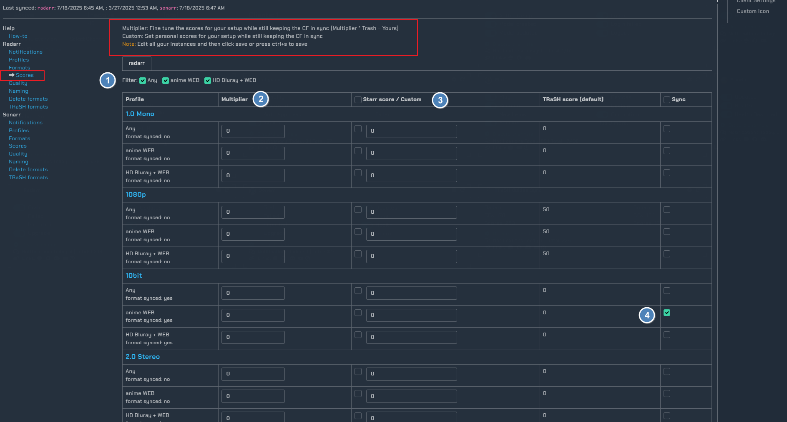

1. Filter between profiles.
2. Multiplier (multiplier * TRaSH = your score)
3. Custom set starr score
4. Sync check box

## Quality

Here you can edit quality names within a specific group and choose too sync them too your starr instance. 

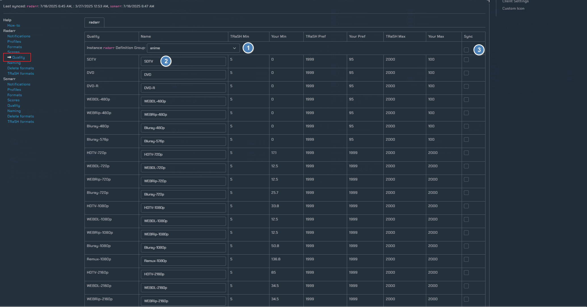

1. Quality group.
2. Rename field
3. Sync check-box

### Naming

Here you can choose a default TRaSH naming scheme for your media files/folders.

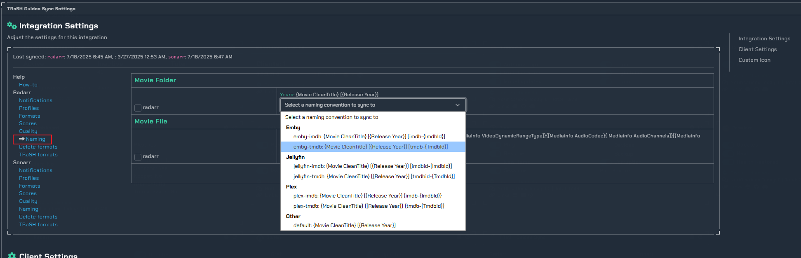

### Delete Formats

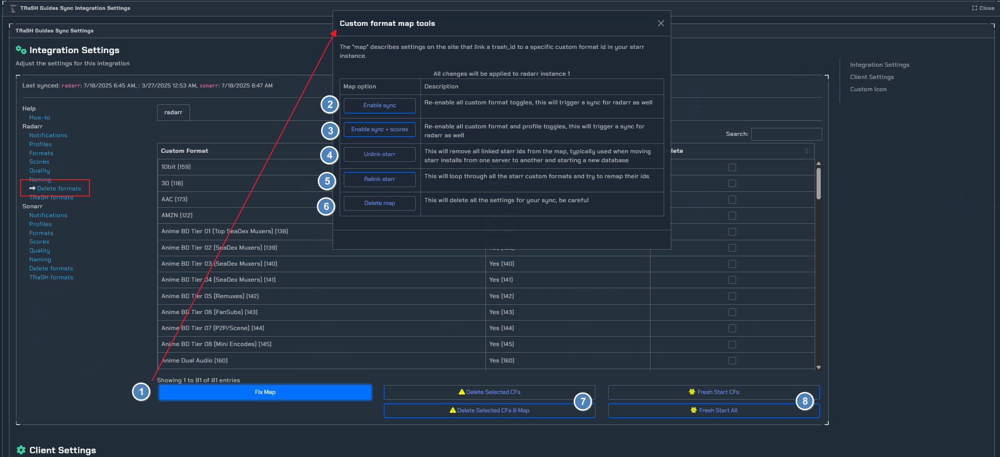

1. Open the Custom Format map tool.
2. Enable sync for all CF's.
3. Enable sync and scores.
4. Unlink your starr id from the map.
5. Relink your starr ip/map.
6. Delete map **BE CAREFUL**
7. delete your CF's and map
8. Fresh start CF's or ALL.
