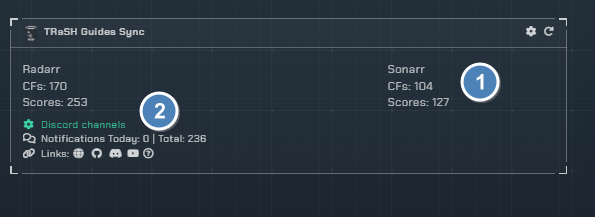
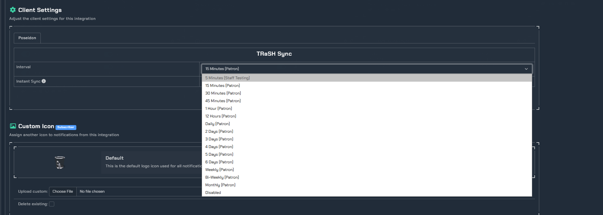
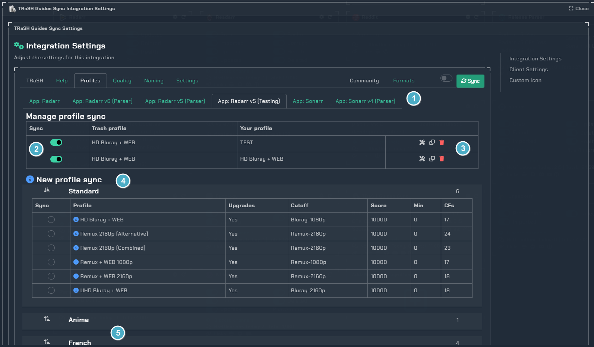
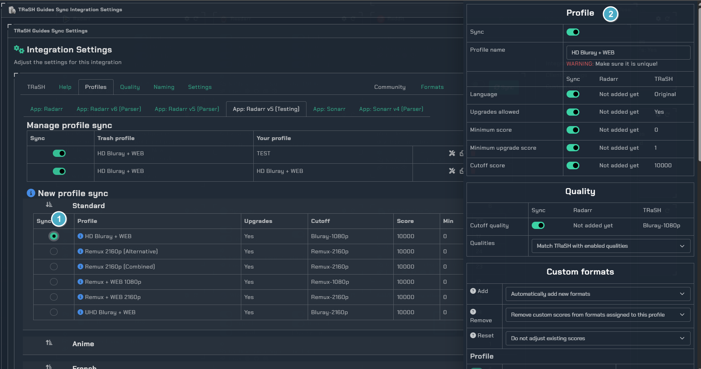
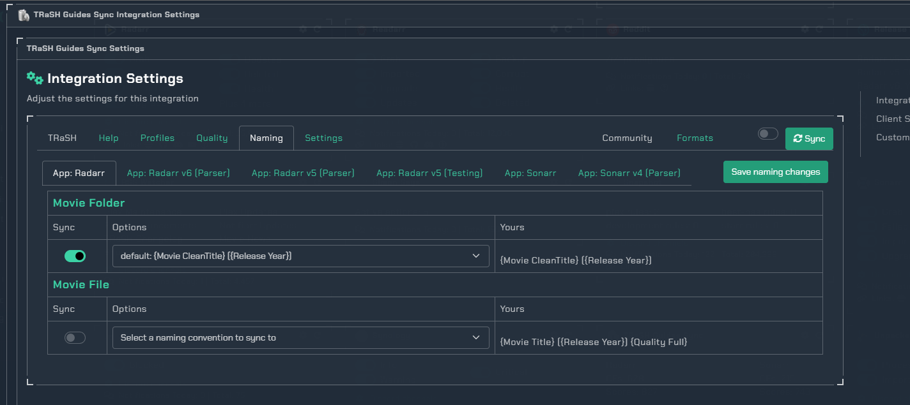
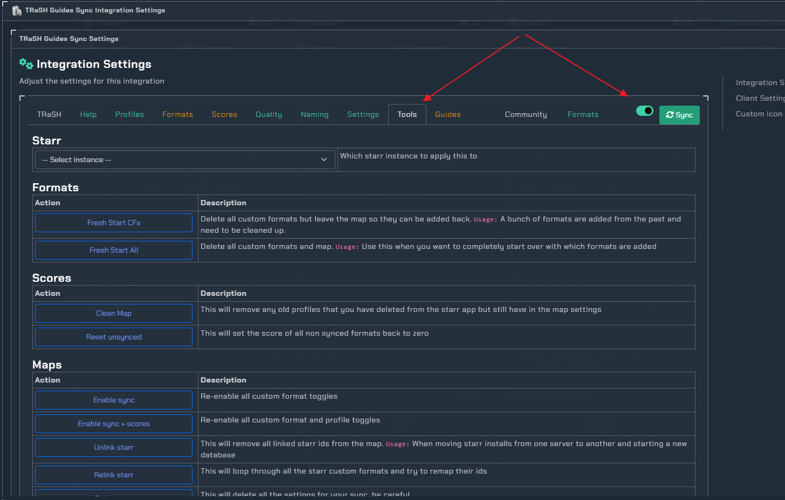

# TRaSH

!!! info "TRaSH"
    This integration allows you to setup and sync TRaSH guides with Radarr and Sonarr. Keep in mind this requires the Notifiarr client.

!!! warning "patrons/subscribers"
    **Patron Feature** - Accessible to [Patrons and Subscribers](../../pages/faq/faq.md#q-what-are-the-user-level-differences) only

!!! note
    If you have questions about what the formats, profiles, scores, etc do then please use the TRaSH [discord](https://trash-guides.info/discord) server for help or check their guide. This wiki is for setting up and getting things in sync.

## Features

| Feature | Patron | Subscriber |
| --- | --- | --- |
| GUI | ✅ | ✅ |
| Multiple instances | ✅ | ✅ |
| 
<b>Formats</b>
 | | |
| Sync | ✅ | ✅ |
| Customize format scores | ✅ | ✅ |
| Apply score multiplier | ✅ | ✅ |
| Mass update scores | ✅ | ✅ |
| Mass delete formats | ✅ | ✅ |
| Notifications | ✅ | ✅ |
| 
<b>Profiles</b>
 | | |
| Sync | ✅ | ✅ |
| Customize profile settings | ✅ | ✅ |
| Clone profiles | ✅ | ✅ |
| Notifications | ✅ | ✅ |
| 
<b>Quality definitions</b>
 | | |
| Sync | ✅ | ✅ |
| Multiple preset quality groups | ✅ | ✅ |
| Notifications | ✅ | ✅ |
| 
<b>File naming</b>
 | | |
| Sync | ✅ | ✅ |
| Multiple preset naming conventions | ✅ | ✅ |
| Notifications | ✅ | ✅ |
| 
<b>Extras</b>
 | | |
| Access to community sync -- Upload your own formats for public/private use | ✅ | ✅ |
| Instant sync when TRaSH updates | | ✅ |
| Jump to top of the querue | | ✅ |
| Trigger a sync from Discord | | ✅ |

## Client Setup

- TRaSH Integration requires the notifiarr client to be running locally, [configured and working (i.e. communicating with) on the Notifiarr site](../../pages/website/clientConfig.md), and the Starr Apps configured.
- Add Starr Apps to the Client in the `Starr Apps` Tab of the Local Client
  - Note that `Time Out` for the Starr Apps **cannot** be set to `Disabled` for the app to be enabled
  - Note that a `Name` value **is required** for the Starr Apps you wish to sync

## Website Setup

### Integration Card

1. `CFs/Scores` - The amount of CF's and scores you have synced.
2. `Channel` - Which channel to send TRaSH update notifications to (when TRaSH updates them, removes them, when you sync them or unsync them)

### Client Settings

This is where you set the interval at which you want the system to compare your current starr settings to the TRaSH guide. If any changes are found on the guide when this interval runs then a sync will trigger and any changes needed will be applied.

##### Getting Started

The layout is pretty simple with a row of tabs for "actions" and a row of tabs for "instances". Use the top row to navigate between the different settings and the second row to apply things to the desired instance. The toggle to the right is for "advanced" items that most will not need to utilize often (or at all) if you simply want to follow the guide profiles.

### Help

Click the **cog icon** in the card header to open the configuration options for TRaSH. To get started, take a look at the "Help" tab, it will only take a few seconds to read over and has some helpful information

### Profiles

Here we can manage existing profiles or add new profiles

1. Starr instances
1. Sync on/off for existing profiles added
1. Tools for existing profile
    - Edit: Make changes to how the profile is synced
    - Clone: Copy the profile as is to another profile or instance
    - Delete: Delete the sync (THIS DOES NOT DELETE THE PROFILE IN THE STARR APP)
1. New profile sync
1. Groups of pre-made profiles

1. New profile to sync
    - Click the info icons for what this profile does
1. Profile settings based on what you want
    - Click the help icons for assistance

### Formats

!!! info
    This tab only shows when the toggle is enabled. If you want to follow the guides based on their profiles you likely do not need to make changes here. If you want to add more formats that are not part of a profile you have in sync, make sure the profile setting for "Remove" is set to allow custom so the sync does not remove it.

1. Filter: You can limit what you see on the page if you know the profile or format group you are working with
1. Format: This is the given format and what group it belongs to
1. Sync: Should this format be added to the instance
1. Times: This is the time when the format was added to the guide and the last time it was modified
1. Scores: Pick which profile you want to sync this format score to
1. Save: After making the changes you want, click the save changes button

### Scores

!!! info
    This tab only shows when the toggle is enabled. If you want to follow the guides based on their profiles you likely do not need to make changes here. If you want to add more formats that are not part of a profile you have in sync, make sure the profile setting for "Remove" is set to allow custom so the sync does not remove it.

1. Filter: You can limit what you see on the page if you know the profile you are working with
1. Format: This is the given format to make score adjustments to
1. Profile: Which profile you want to apply the score changes to
1. Multiplier: Fine tune the scores for your setup while still keeping the CF in sync (Multiplier * Trash = Yours)
1. Custom: Set personal scores for your setup while still keeping the CF in sync
1. Sync: Should this format score be added to the profile
1. Save: After making the changes you want, click the save changes button

### Quality

Here you can edit quality names within a specific group and choose to sync them to your starr instance.

1. Definition group: Preset quality value groups
1. Sync: Decide which values to keep in sync
1. Save: After making the changes you want, click the save changes button

### Naming

Here you can choose a default TRaSH naming scheme for your media. There are recommended presets for most applications used today.

After making the changes you want, click the save changes button

### Settings

1. The last time a sync was ran that checked for changes (triggered by a change in the guide or a manual sync)
1. Usually these will want to be enabled to keep the format names etc. matching the guides
1. Some areas have a dialog that will popup with the status of the changes, when this is on that popup will auto close for you once completed
1. Decide which notifications you want for which sync options

### Tools

!!! info
    This tab only shows when the toggle is enabled

This section has "one off" actions that can be applied to an instance but really isnt needed very often if ever. Each tool has a description of what it will do, we suggest not using them unless you have talked with us and that is where we send you to fix the given problem.

### Guides

!!! info
    This tab only shows when the toggle is enabled

This section is not important in terms of syncing but contains all the formats from the guides in a readable/searchable table

### Community

!!! warning
    This section is still under development and only available on nightly. It is complete to the point of syncing the selected community formats.

### Syncing

After you have made all the changes you want to make, click the `Sync` button at the top right. This will trigger a client reload to fetch any new settings it needs and then tell the client to check for changes and apply them. It will bypass any pre-checks such as guide changes or intervals.
