!!! info "TRaSH"
    This integration allows you to setup and sync TRaSH guides with Radarr and Sonarr. Keep in mind this requires the Notifiarr client.

!!! warning "patrons/subscribers"
    **Patron Feature** - Acessible to [Patrons and Subscribers](../../pages/faq/faq.md#q-what-are-the-user-level-differences) only

!!! warning
    Users switching from an existing Sonarr v3 instance to Sonarr v4 [have additional steps that are required](#sonarr-v3-to-v4-migration)

# Client Setup

- TRaSH Integration requires the notifiarr client to be running locally, [configured and working (i.e. communicating with) on the Notifiarr site](../../pages/website/clientConfig.md), and the Starr Apps configured.
- Add Starr Apps to the Client in the `Starr Apps` Tab of the Local Client
  - Note that `Time Out` for the Starr Apps **cannot** be set to `Disabled` for the app to be enabled
  - Note that a `Name` value **is required** for the Starr Apps you wish to sync

# Integration Card

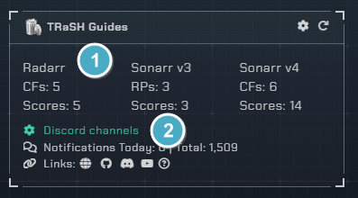

1. Sync
    - The amount of CF's and scores you have in sync
1. Channel
    - Which channel to send TRaSH update notifications to (when TRaSH updates them, removes them, when you sync them or unsync them)

# Integration Settings

Click the **cog icon** in the card header to open the configuration options for TRaSH.

## Client Settings

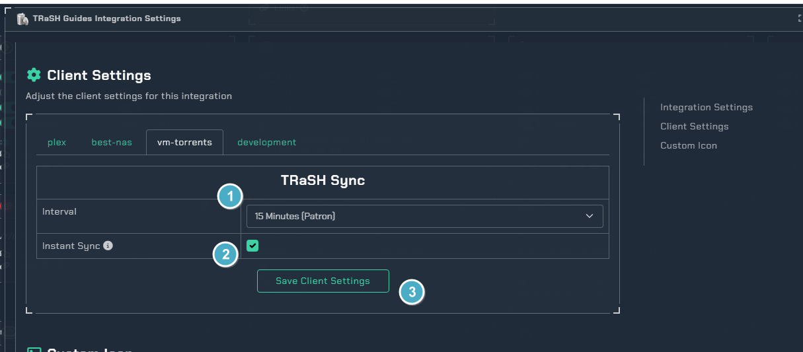

### Interval Options

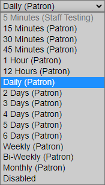

2. This will sync your CF changes as soon as TRaSH pushes them (Subscriber feature)
3. This will save the client settings

## Notification Triggers

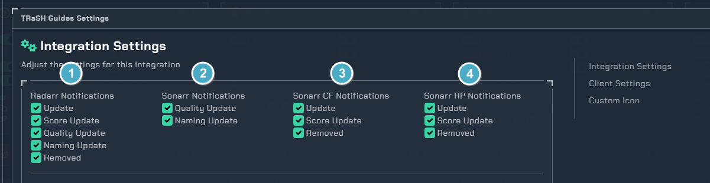

 1. Radarr Notifications
    - `Update`  When differences are detected and notifiarr syncs
    - `Score Update` When Score changes are detected and updated
    - `Quality Update` When Quality Definitions are updated
    - `Removed` When a CF is removed from the guide
 2. Sonarr Notifications
    - `Quality Update` When Quality Definitions are updated
 3. Sonarr CF Notifications **Requires V4**
    - `Update`  When differences are detected and notifiarr syncs
    - `Score Update` When Score changes are detected and updated
    - `Removed` When a CF is removed from the guide
 4. Sonarr RP Notifications **Requires V3**
    - `Update`  When differences are detected and notifiarr syncs
    - `Score Update` When Score changes are detected and updated
    - `Removed` When a CF is removed from the guide

## Quality Definitions

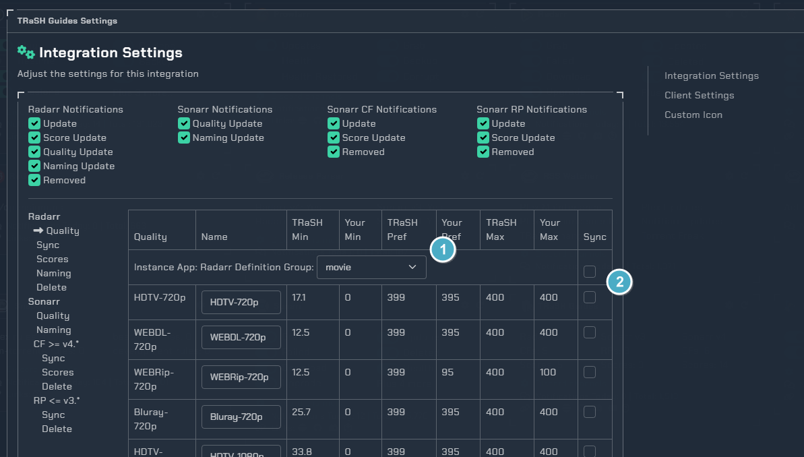

1. Quality Definition Options
Radarr
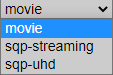
Sonarr
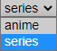
2. Sync toggles
   - You can set all at once or each individually to keep synced

## Radarr Sync & V4 Sonarr

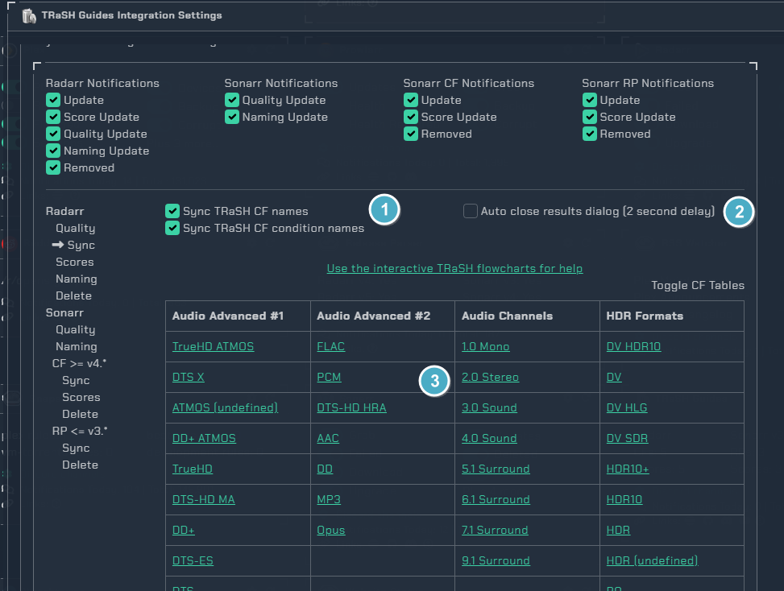

1. Sync TRaSH CF Names
   - `Names` This will sync the names of the TRaSH Custom format especially important for ones such as `AMZN` that includes the custom format in the renaming
   - `Condition Names` This will sync the condition names in the custom format to match TRaSH Condition Names
2. Auto close results dialog will close the pop up showing the progress and results of the syncing
3. Clicking one of the CFs in this table will send you down to the Custom Format settings of the one you clicked which is explained in the next section

### Custom Formats & V4 Sonarr

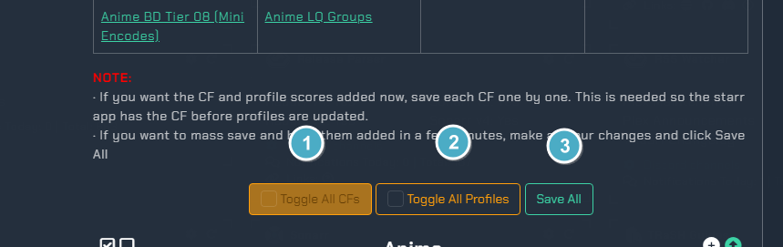

1. This will toggle on all custom formats in all your Radarr instances **Be very careful with this option**
2. This will toggle on all scores to be synced in all your Radarr instances
3. This will save all your settings and initiate a client sync

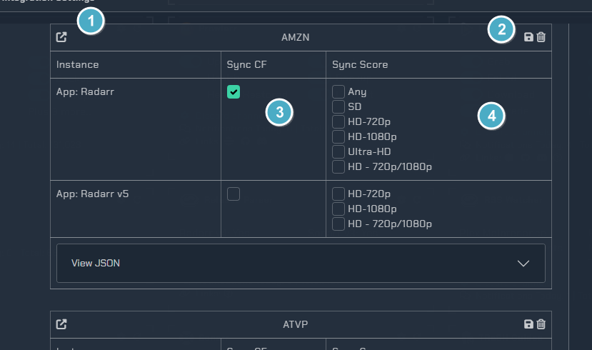

1. This will open the CF on the TRaSH guides site
2. This will save or delete the CF from all your instances right away
3. These toggles will enable the Custom Format
4. These toggles will turn on syncing the scores from TRaSH in your Quality Profile

### Flowcharts for help
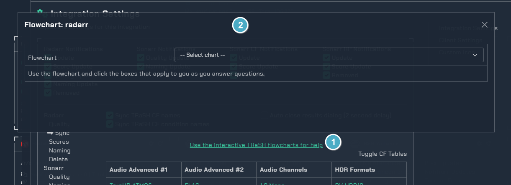
1. Opens the flowchart selector
2. Flowcharts **SQP Flowchart should not be selected without joining the [SQP Trash Discord Channel](https://discord.com/invite/Vau8dZ3)**

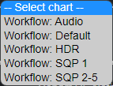
#### Default Flowchart

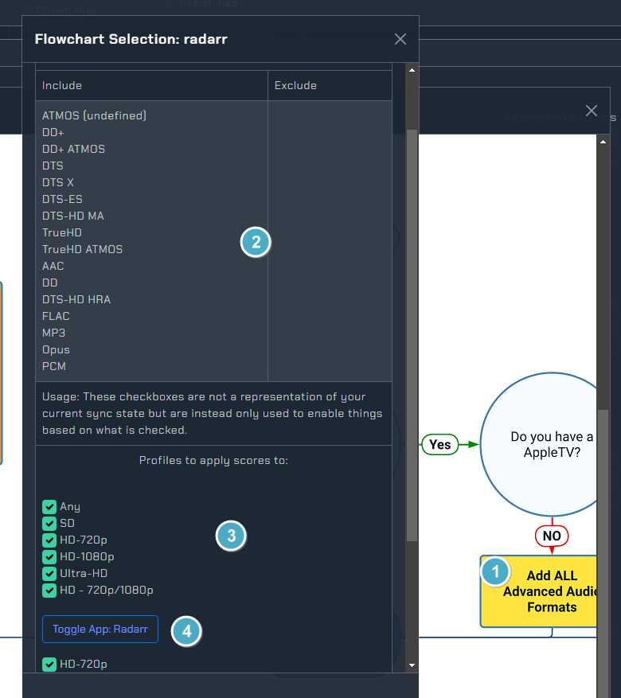

1. Clicking the Yellow scare will open the Custom Formats list for these matching conditions
2. List of the Custom Formats for the condition you selected
3. Choose which profiles for which instance you want to apply this to
4. Clicking the button will enable them for the specified Instance, to save and initiate sync you can refer to [Custom Formats](../../pages/integrations/trash.md#custom-formats--v4-sonarr)

## Radarr Scores & V4 Sonarr

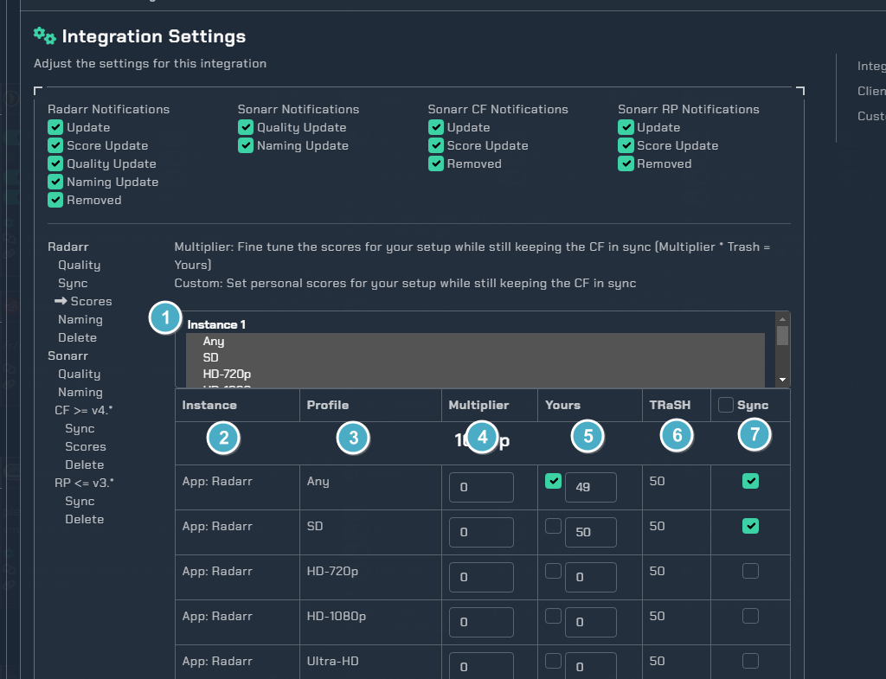

1. Quality Profile Selection Dropdown menu

- If you toggle off one of the profiles it won't show in the scores list
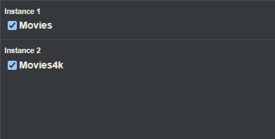

2. CF Name and the instance it is in
3. The Quality Profile you are syncing the score to
4. You can input a multiplier here to subtract or add a percentage to the synced TRaSH score
   - Such as multiplier of 0.8 would reduce it by 20%
5. The current score of the CF in the Quality Profile
   - Tick the checkbox if you wish to manually edit the score directly and disable sync
6. This is  the current TRaSH Guide score for this CF
7. This checkbox will enable score sync for all Custom Formats in the list
   - You can also tick each checkbox individually and choose which you want to be synced to which profile

## Naming Conventions
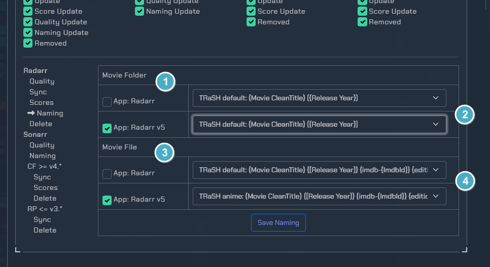

1. Movie folder naming
2. Pick to use a variation of naming that TRaSH recommends
3. Movie file naming
4. Pick to use a variation of naming that TRaSH recommends

## Radarr Delete & V4 Sonarr

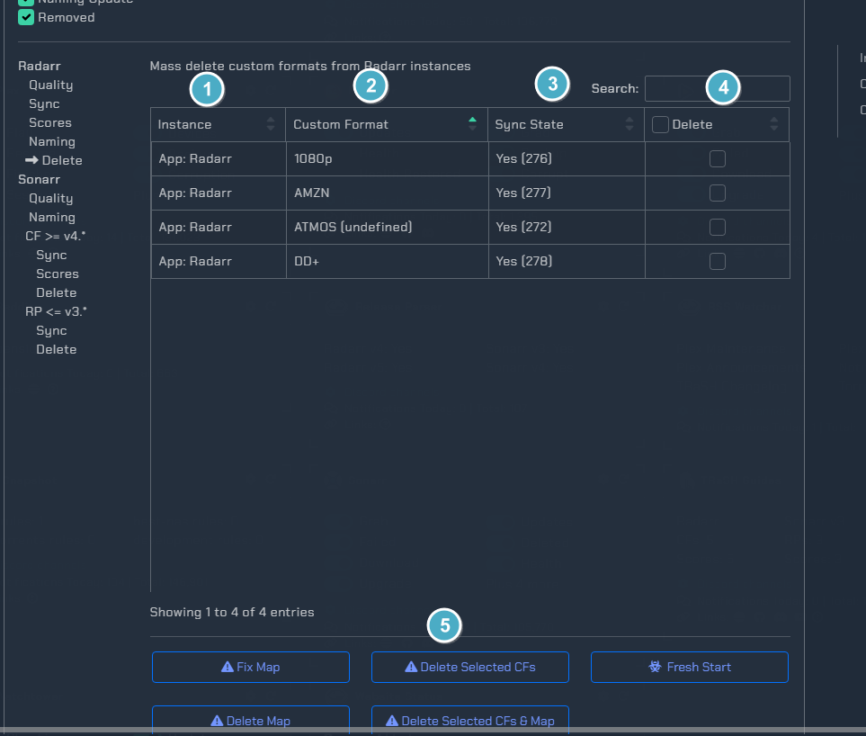

1. Instance the CF is in
2. The Custom Format name
3. Shows whether the CF is synced or not and the ID for it
4. This checkbox will mark all CFs for deletion
   - You can also mark them individually for deletion
5. Actions
   - `Fix Map` This will re-enable disabled CFs and Scores that exist in radarr so the sync can add them back or re-map them
   - `Delete CFs` This will delete the marked CFs and let the sync put them back as needed
   - `Delete CFs & Map` Delete the marked CFs and the map so they will no longer sync
   - `Delete Map` Delete the site map for the radarr instance and start over Disables Sync

## Sonarr Delete V3

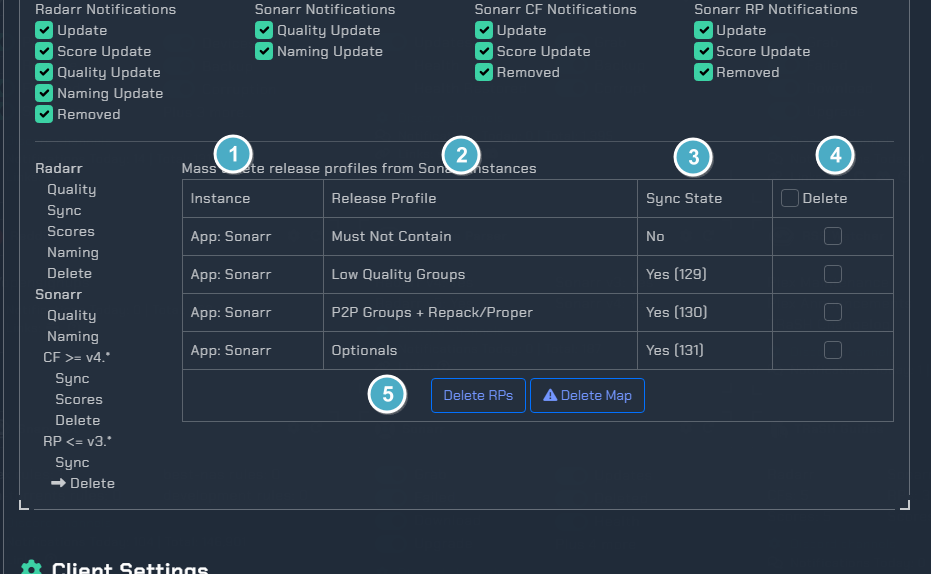

1. Instance the RP is in
2. The Release Profile name
3. Shows whether the RP is synced or not
4. This checkbox will mark all RPs for deletion
   - You can also mark them individually for deletion
5. Actions
   - `Delete RPs` This will delete the marked RPs so they can sync again
   - `Delete Map` Delete the sync map for sonarr instances and start over Disables Sync

## Sonarr Sync V3

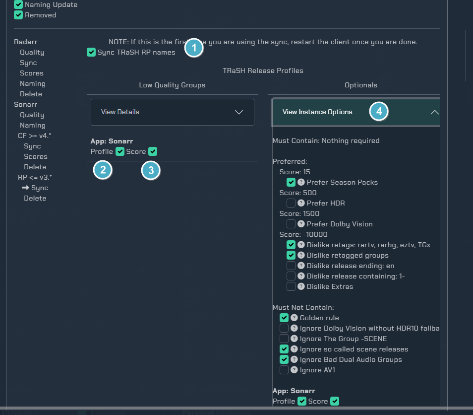

1. This will sync the Release Profile names with TRaSH Guides
2. This toggle will enable the Release Profile sync to the selected instance
3. This toggle will enable keeping the TRaSH guide scores in sync on this RP
4. These will toggle the settings you wanna sync to the Optionals RP
   - Tick the checkboxes of the options you want and then enable the Profile and Score sync

## Sonarr v3 to v4 Migration

- Users with an existing v3 instance they upgraded to v4 have some manual migration steps required.
1. Open the TRaSH Guides integration on Notifiarr
1. on the left in the Sonarr group click the Delete link in the `RP <= v3.*` section.
1. In the popup click the Delete Map button and clear the maps.
1. (Optional) As Sonarr v4 does a less than optimal job of migrating Preferred Words to Custom Formats, you can use Notifiarr to bulk delete. Click the Delete link in the `CF >= 4.*` You can then mass delete all the migrated CFs to start fresh. Then you can configure Notifiarr to sync the Custom Formats you want to use.

!!! info "Sonarr v4"
    For Sonarr v4 specific (non-Notifiarr Sonarr related) support questions, visit Sonarr's discord, forums, or subreddit.
