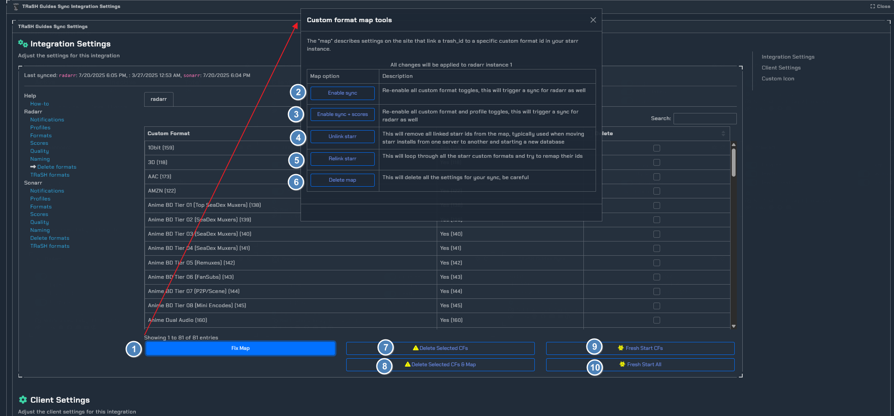

# TRaSH

!!! info "TRaSH"

    This integration allows you to setup and sync TRaSH guides with Radarr and Sonarr. Keep in mind this requires the Notifiarr client.

!!! warning "patrons/subscribers"
    **Patron Feature** - Acessible to [Patrons and Subscribers](../../pages/faq/faq.md#q-what-are-the-user-level-differences) only

!!! note
    If you have questions about what the formats, profiles, scores, etc do then please use the TRaSH [discord](https://trash-guides.info/discord) server for help or check their guide. This wiki is for setting up and getting things in sync.

## Features

| Feature | Patron | Subscriber |
|---|---|---|
| GUI | ✅ | ✅ |
| Multiple instances | ✅ | ✅ |
| 
<b>Formats</b>
 | | |
| Sync | ✅ | ✅ |
| Customize format scores | ✅ | ✅ |
| Apply score multiplier | ✅ | ✅ |
| Mass update scores | ✅ | ✅ |
| Mass delete formats | ✅ | ✅ |
| Notifications | ✅ | ✅ |
| 
<b>Profiles</b>
 | | |
| Sync | ✅ | ✅ |
| Customize profile settings | ✅ | ✅ |
| Clone profiles | ✅ | ✅ |
| Notifications | ✅ | ✅ |
| 
<b>Quality definitions</b>
 | | |
| Sync | ✅ | ✅ |
| Multiple preset quality groups | ✅ | ✅ |
| Notifications | ✅ | ✅ |
| 
<b>File naming</b>
 | | |
| Sync | ✅ | ✅ |
| Multiple preset naming conventions | ✅ | ✅ |
| Notifications | ✅ | ✅ |
| 
<b>Extras</b>
 | | |
| Access to community sync -- Upload your own formats for public/private use | ✅ | ✅ |
| Instant sync when TRaSH updates | | ✅ |
| Jump to top of the querue | | ✅ |
| Trigger a sync from Discord | | ✅ |

## Client Setup

- TRaSH Integration requires the notifiarr client to be running locally, [configured and working (i.e. communicating with) on the Notifiarr site](../../pages/website/clientConfig.md), and the Starr Apps configured.
- Add Starr Apps to the Client in the `Starr Apps` Tab of the Local Client
  - Note that `Time Out` for the Starr Apps **cannot** be set to `Disabled` for the app to be enabled
  - Note that a `Name` value **is required** for the Starr Apps you wish to sync

### Integration Card

1. `CFs/Scores` - The amount of CF's and scores you have synced.

2. `Channel` - Which channel to send TRaSH update notifications to (when TRaSH updates them, removes them, when you sync them or unsync them)

## Getting Started

Click the **cog icon** in the card header to open the configuration options for TRaSH. To get started, you will need to go to Help → How-to.

## Client Settings

here you can change the interval for your profile's sync.

### Notifications

Here we can individually select what we would want to be notified of. For this example we selected all available triggers.

### Profiles

here we can manange existing profiles or add new profiles/link predefined TRaSH profiles. For this guide we are going to add the TRaSH **HD Bluray + WEB** profile

!!! info
    After selecting the profile as shown above you will be directed to the profile settings.

1. `Sync` - Enable this to sync your profile.

2. `Starr instance profile` - Either create a new profile or select one of the TRaSH profiles available.

3. `Profile name` - Here you can set your profile name **This needs to be unique**.

!!! Note
    If you plan to use TRaSH as default you can stop here and save your settings. Below we will got into customizing the profile, quality, and CF's.

!!! warning SAVE PROFILE SYNC
    **MAKE SURE TO SAVE YOUR PROFILE SYNC, THIS IS DIFFERENT FROM SAVE CLIENT SETTINGS**

### Profile Customization

!!! info
    Check-box means you want to sync TRaSH values and cannot change them in your ARR's as they will revert back after each sync is made. Uncheck any that you want to customize, And do so inside of your ARR's.

1. `Language` - If you want to sync your prefered language, **Disable this if you plan to use something other then the TRaSH default.

2. `Upgrades allowed` - Enable this if you plan to allow upgrades in your profile.

3. `Minimum score` - Enable this to set the minimum download score to 0.

4. `Minimum upgrade score` - enable this to set the minimim score increase to allow a upgrade.

5. `Cutoff score` - Enable this to set the cutoff score. **default set 10000**

### Quality Settings

!!! warning
    If you plan on changing the qualities in the profile, you will need to enable the allow custom quality order/groupings, if this is not enabled any changes made to the quality grouping will be reverted after each sync.

1. `Cutoff quality` - Cutoff quality is the quality that you want your starr instance to stop upgrading at. `Bluray-1080p`

2. `Qualities` - You can choose to either match the TRaSH quality groups, or you can set this to allow custom set groups. For example we want to use the TRaSH `HD Bluray + WEB` profile but we don't want to include `720p`.

### Custom Formats "CF"

1. `Add` - You can choose to either automatically add new formats, add missing formats, or add none.

2. `Remove` - You can choose to remove custom scores on each sync, or if you want to set your own scores you would want to `allow custom scores from formats assigned to this profile`. If your planning to set scores different then what TRaSH has then you would want to set this to `allow`.

3. `Groups` - This is where you can select each group that you want in your profile sync, along with the available CF's within that group.

### Formats

!!! info
    Here you will find all of the available TRaSH guide formats. You can find more info on these at [TRaSH Guides](https://trash-guides.info/)

1. `Sync TRaSH CF names` - If you want to sync the names set for the TRaSH CFs.

2. `Interactive flowchart` - Useful interactive flow charts for TRaSH profiles.

### Scores

Here you can setup custom scores to your liking, and choose to sync them.

1. `Filter` - Filter between witch profile you're editing/looking at.

2. `Multiplier` - (multiplier * TRaSH = your score)

3. `Starr score/Custom` - Here you can set personal scores while still keeping your CF's in sync.

4. `Sync` - Check-box to enable sync.

## Quality

Here you can edit quality names within a specific group and choose to sync them to your starr instance.

1. `Definition group`- Here you can choose the starr profile, that you plan to edit or change.

2. `Rename Field` - This is where you can customize the name of a quality.

3. `Sync` - Check-box to enable sync.

### Naming

Here you can choose a default TRaSH naming scheme for your media. There are recommended presets for most applications used today.

### Delete Formats

1. `Fix Map` - This will open the mapping tool options.

2. `Enable sync` - This will re-enable all the CF toggles, this is useful if you want to change the selected CF's.

3. `Enable sync + scores` - This will re-enable all the CF toggles, and scores. This is useful if you want to change CF's and scores.

4. `Unlink starr` - This will unlink your starr id's from the map. This is useful if your moving your starr install to a different server or if your changing databases.

5. `Relink starr` - This will attempt to re-link your starr instance id's and CF's to the map.

6. `Delete map` - This will delete all of your sync settings. Useful for starting fresh.

7. `Delete Selected CFs` - This will delete all of the selected CF's in your profile. 

8. `Delete Selected CFs & Map` - This will delete all of your CF's and the profile mapping.

9. `Fresh Start CFs` - This will delete all the formats but leave the map so a sync would put everything back that is in sync. This is useful to clean things up without loosing your sync settings.

10. `Fresh Start All` - This would delete all CF's/scores/ect. Only do this if you want to nuke everything and start over.
