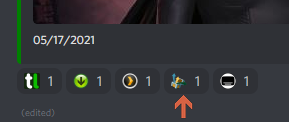
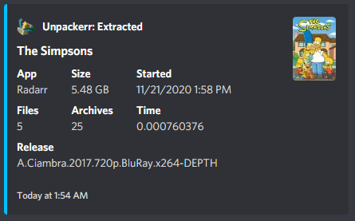

# Unpackerr

!!! info
    This integration provides [Unpackerr](https://golift.io/unpackerr) notifications and reactions.

You may choose to have either a reaction placed on existing Starr notifications, or receive a stand alone message for Unpackerr notifications, or both. Selecting the *Reactions* box enables or disables the Reaction emoji.

As a premium feature you may elect to have Unpackerr notifications automatically add Custom Formats to your Starr apps. These custom formats downgrade the priority on the release group that gave you a packed download. That means in time your Starr apps will choose to download fewer and fewer packed items.

## Reaction example

## Notification Example

