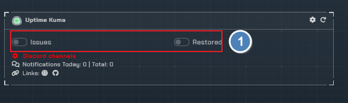
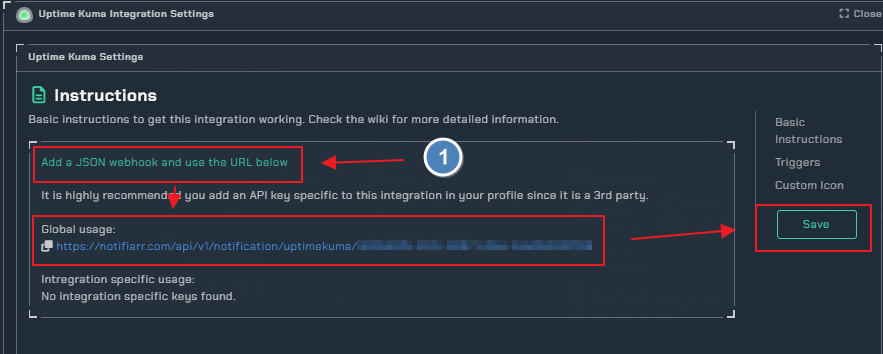
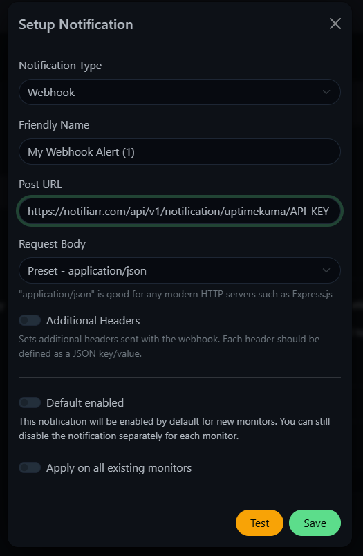
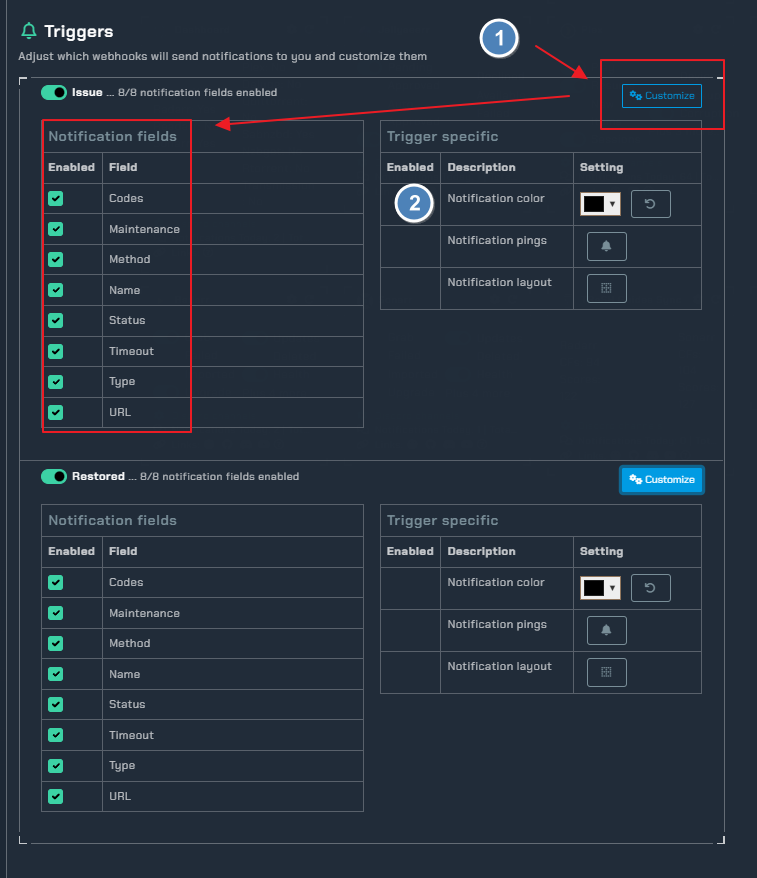
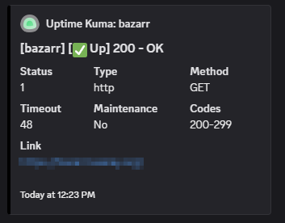
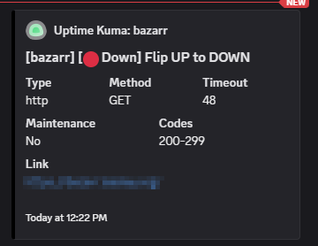

# Uptime-Kuma

!!! note

    setup notifications for Uptime Kuma

## Trigger Options

- `issues` - be notified of any issues
- `restored` - be notified when sites are back up

## Instructions

!!! note

    refer to [Uptime-Kuma](https://github.com/louislam/uptime-kuma/wiki) for more details

!!! info

    Add the webhook too your Uptime Kuma via Uptime-Kuma &rarr; Settings &rarr; Notifications &rarr; Setup Notifications

### Configuration

1. click the `Customize` toggle to open the trigger settings.
2. Choose the color of your notifcation

## Examples

uptime-Kuma UP         |  Uptime-Kuma DOWN
:-------------------------:|:-------------------------:
  |  
