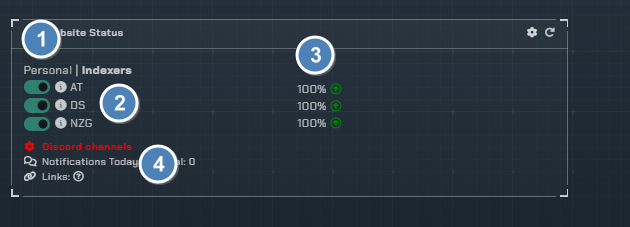
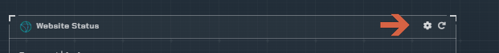
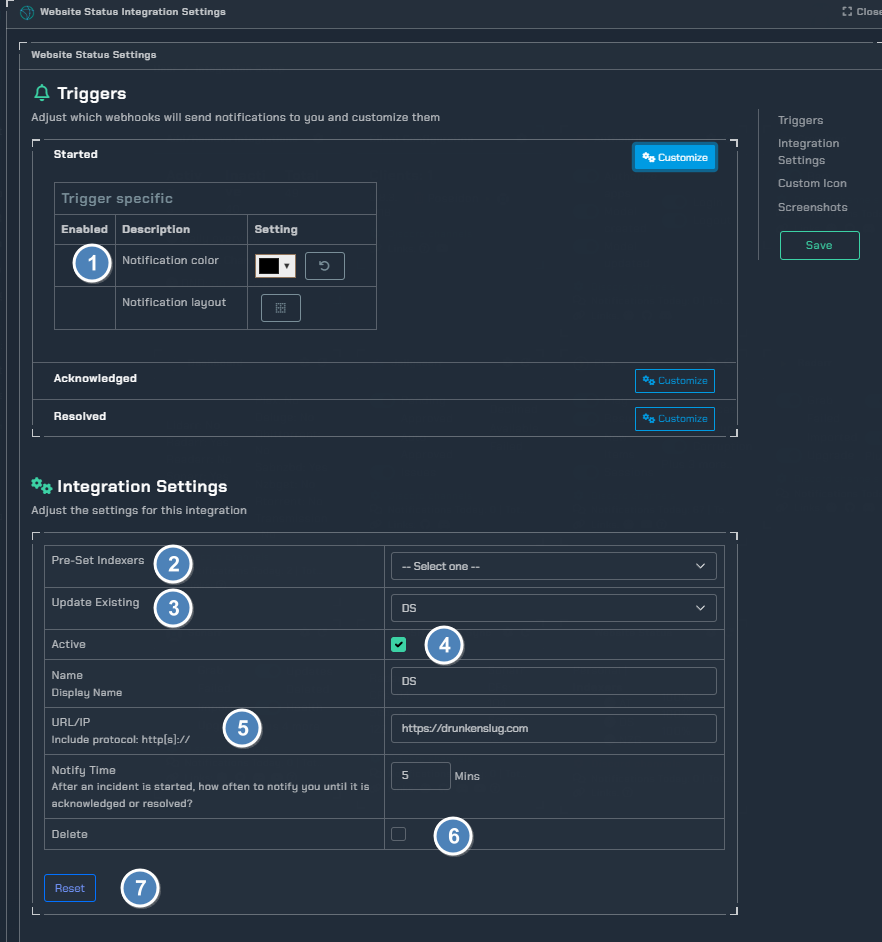

!!! info
     This integration allows for notifications based on website status.

## Trigger options

1. Toggle on/off for each website being monitored
1. List of websites being monitored (Click the information icon for some simple stats)
1. Uptime percentage since monitoring started
1. Channel to post notifications to

---

## Configuration

Click the **cog icon** to open the configuration options for website monitoring.

1. Colors for notifications based on status
2. Select pre-defined indexters to monitor
3. Update the selected indexer
4. toggle active state on/off
5. URL of the desired website
6. Delete toggle "browser popup to confirm action"
7. reset all integration settings
