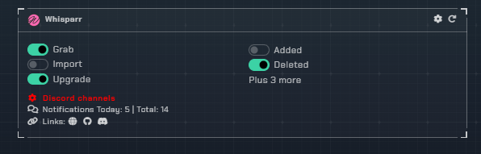
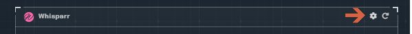
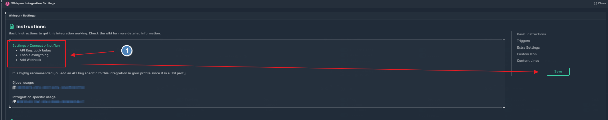
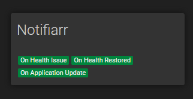
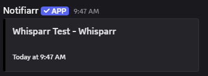
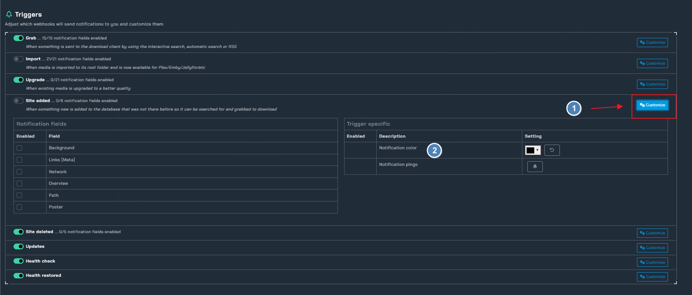
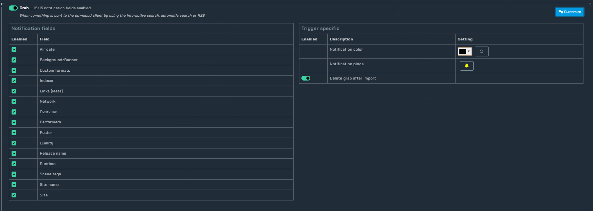
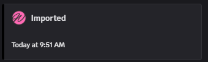
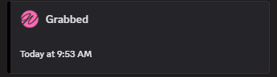

# Whisparr

!!! info
     This integration is for setting up discord notifications for Whisparr

!!! Warning "Whisparr"
    **NSFW content will not be shown**

## Trigger options

- `Grab` - Notifications for grabs that occur
- `Imports` - Notifications for when media is imported
- `Upgrade` - Notifications for media upgrades
- `Added` - Notifications for new media added
- `Deleted` - Notifications for when media is deleted
- `Updates` - Notifications for system updates
- `Health Check` Notifications for health checks
- `Health Restored` - Notifications for health restored to normal

---

## Instructions

- Click the cog icon to open the settings

1. Instructions on how to setup the notifiarr connect in prowlarr

!!! info
    Add the Connect using its built in Connection for **Notifiarr**. In Whisparr click Settings → Connect → <kb>+</kb> → Notifiarr, once done correctly you will recieve a test notification :smile:

Whisparr Connect            |  Test Notification
:-------------------------:|:-------------------------:
  |  

---

## Configuration

1. click the `Customize` toggle to open the trigger settings.
2. Choose the color of your notifcation

- here are all the avialable `Notification Fields` under the `Grab` trigger as you can see there is alot of customization for your specific needs :smile:

---

### Examples

Whisparr Imported         |  Whisparr Grabbed
:-------------------------:|:-------------------------:
  |  
