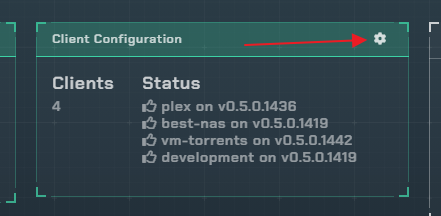
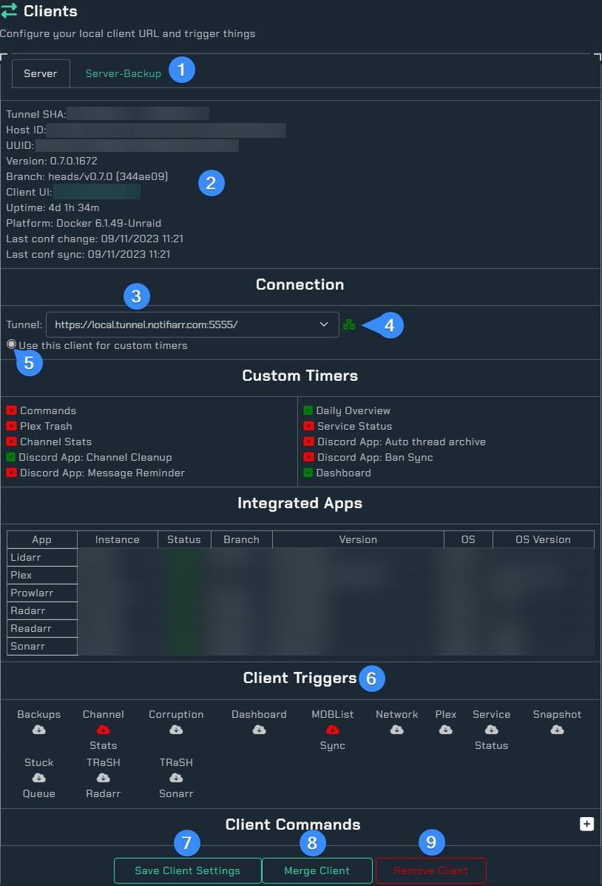
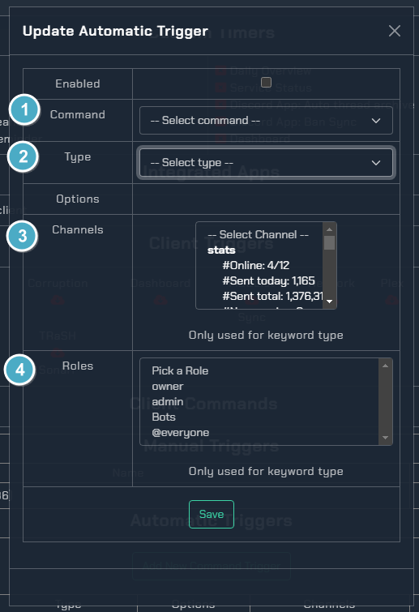

# Clients Setup

The client is used to do all local communication between the site and your system. This allows all urls, apikeys, etc to stay local and requires apikey validation between the site and the client before any actions can be taken.

You may run more than 1 client, and it is recommended if you have more than 1 system to monitor.

Depending on your layout (Grid or List) you will see:

 

When you open the client settings you will see:



1. Client list: Each client you have configured will show up as a tab so its settings can be modified
2. This section is information about the local client and its host environment
3. This is the automatically configured `Tunnel URL` to the client so the site can communicate with the locally installed client 
4. This is the connection status, if it isn't green then the site can not reach the client. See [Errors](#errors) below.
5. Use this client for timers that are not part of a specific integration (non client integrated timers, daily overview posts for example)
6. Client triggers: If the URL is provided, you can trigger the client to run any of these actions by clicking the cloud icon

 1. Save button: Once done, click this and it will update all your settings. If a URL is provided it will trigger the client to fetch the new settings right then. If no URL is provided then you can restart the client manually to pull the changed settings or wait 5 minutes for the client poller to request any changed settings and update
 1. If you have a duplicate client showup (change the user, hostname changed, etc) you can merge the new client with the old one so all the settings copy over and the old one is removed
 1. If you no longer have the client installed on a specific hostname, you can remove it
 
## Commands

> This is a **subscriber** feature, you can add them in the client and run them from the client without being a subscriber but no automation will be available from the site.
{.is-info}
 
### Client

First thing is to add a command in the local client. Commands are basically custom scripts you want to trigger. Read below to understand how they work and then add them to the client.
 
 
 
 1. Open the Commands section in the local client UI
 2. Name of the command
 
 Click the (?) icons for more information on each box
 
### Website

At the bottom of the client configuration is a `Commands` section
 
 
 
 1. Click the `+` to expand the command settings
 
 
 
1. This table will allow running any client configured commands by clicking the cloud icon
2. This will allow adding commands to be automatically triggered based on options (image and info below)
3. This table is a list of automated commands
 

 
1. Pick which command (must be added to the client already) to configure automation for
2. What type of command
- Auto triggered
This has options such as a network notification that Plex is down, it can auto trigger a command to run (example below)
- Keyword
This is a discord keyword such as `!plexRestart` to trigger the command to run
- Timer
This will run commands on a schedule
 3. Which channel(s) can the keyword be used in
 4. Which role(s) can use the keyword to trigger the command
 
### Command Example

The network integration is enabled and Plex is being monitored so when Plex goes down a notification is sent to Discord. With that in mind we want Plex to automatically restart its self at that point so a command is used.
 
plexRestart.ps1

```powershell
taskkill /IM "Plex Media Server.exe" /F
Start-Process -FilePath "C:\Program Files (x86)\Plex\Plex Media Server\Plex Media Server.exe"
```
 
This script is on the computer and the command to run `plexRestart.ps1` is added in the client. With that done, we can now set it up to trigger this command when the network notification comes in that it is down. As seen above there is also a keyword configured with `!plexRestart` so if we want to restart it on demand (maybe it is slow or acting up) we can do that as well.
 
## Errors
 
- If the icon does not turn green, you can see the error and details in the **Console** via the Browser's DevTools (F12 in most browsers). Some common issues are listed below. 
- App in the client is taking too long to respond causing timeouts. Disable all apps and re-enable 1x1 to identify the culprit


## Duplicate Clients

- This typically occurs in Docker or \*BSD when a [hostname is not configured](/Client/Configuration#hostname) everytime the container is restarted.
- For other installations this would occur if the unique attributes of your host system and installation change.

### Resolving Duplicate Clients

1. Configure/Set a hostname for the client if applicable or resolve the changing attributes
1. Restart the client
1. On the Website in Client Configuration, Delete all client entries between the first and last client
1. On the Website in Client Configuration, Merge the remaining two client entries