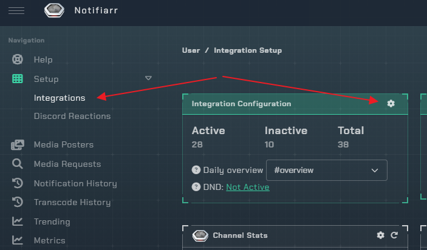
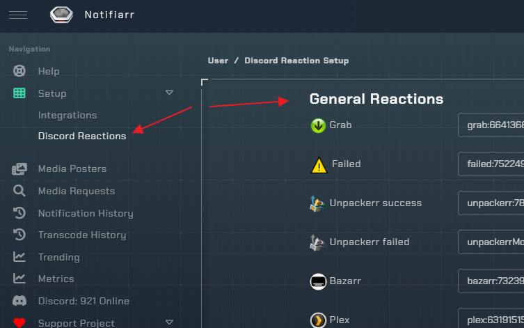

# Main Setup

1. Open the integrations page
1. Click the cog wheel (Card view). All available integrations have to be enabled before they can be used.

1. Once you open the `Integration Configuration` you only need to toggle on/off what you want to use.

## Reactions Setup

- You can use any emoji you prefer for reactions, however, if you would like to use the existing set of emoji provided by Notifiarr, visit [notifiarr-reactions](https://notifiarr.com/user.php?page=setup&grab=reactions) and save the .zip file.

- After extracting the contents of the zip file, you can choose which emoji you would like to use by uploading them to your Discord server.

- For instructions on uploading emoji to your server, please visit this article from Discord: [discord-custom-emoji](https://support.discord.com/hc/en-us/articles/360036479811-Custom-Emojis)

- Once you've uploaded the emoji you want to use, you will need to find the emoji's ID for your server.  To do this:
  
1. Go to any channel on your server and type `\:emoji_name:` (replace `emoji_name` with the actual name/alias you are using for the emoji when you uploaded it to your server) then press Enter.

2. You will see a message in your chat that looks like `<:emoji_name:1069872535814496896>`. In this example, `emoji_name` represents the name/alias of the emoji, and the string of numbers after the colon is the emoji ID.

- Copy this value, without the brackets or leading colon (in this example, you would copy `emoji_name:1069872535814496896`) and paste the results in the Discord settings field that corresponds to the reaction you are using the emoji for.

## Discord Server Missing from Dropdown

- This should only be an issue if you linked your Discord account to Notifiarr before creating the server.
- If you created the server after you already authorized your account, give it 5 minutes and re-authorize so it re-fetches the server list.
