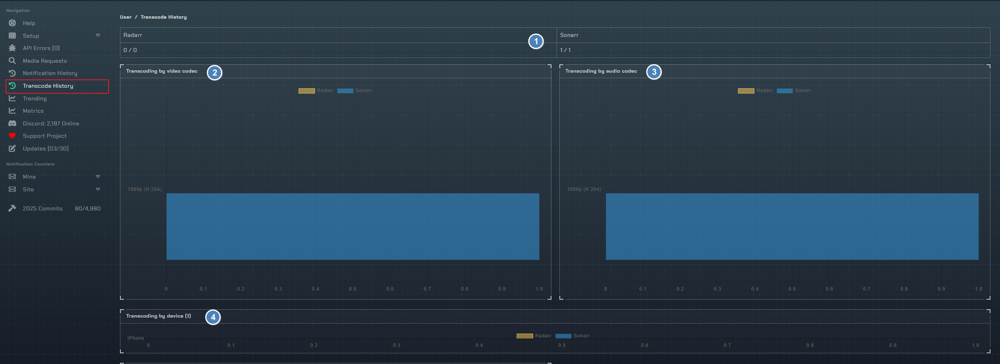

# Transcode History

Transcode History is a history of all Plex Streams Notifiarr recieved from your Plex Server.

It is required that you have a Notifiarr Profile retention of 1 or more days to see this data. This information is gathered from the following Notifiarr Plex Notifications:
- Play
- Resume
- Session

## Graphs

1. The amount of transcodes overall in the last 30 days
1. Video transcodes
1. Audio Transcodes
1. Transcode by device

## Details

This is a detailed table of each transcode. It will show what was transcoded (audio, video or both), the user and device.
