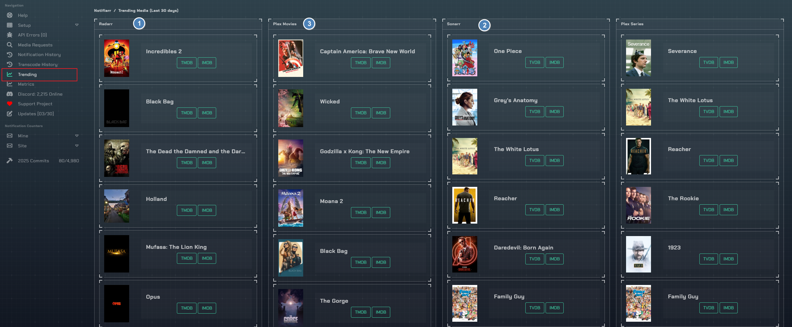
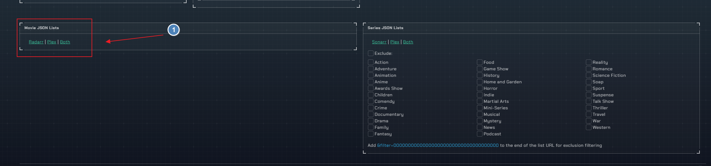

# Trending

1. Most grabbed among all users with Sonarr enabled in the last 30 days
1. Most grabbed among all users with Radarr enabled in the last 30 days

- Same idea if you scroll down for those with Plex enabled

1. Add this as a list to \*arr with a Steven Lu list
